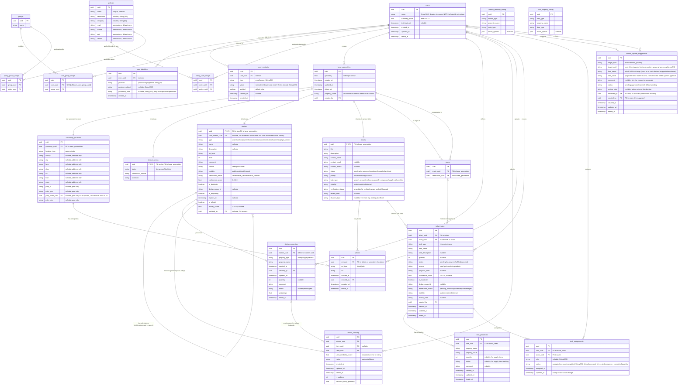

# ER Diagram

> Generated by Gemini Pro 3, updated to match alembic migrations (as of 2026-06-08).

```mermaid
erDiagram


users {
        uuid uuid PK
        string name "String(100), display nickname; NOT the login id, not unique"
        float credibility_score "default 50.0"
        timestamp last_login_at "nullable"
        timestamp created_at
        timestamp updated_at
        timestamp delete_at
    }

  user_identities {
      uuid uuid PK
      uuid user_uuid FK "indexed"
      string provider "password/google/line, String(20)"
      string provider_subject "nullable, String(255)"
      string password_hash "nullable, String(512), only when provider=password"
      timestamp created_at
  }
  %% UNIQUE(provider, provider_subject) -- uq_identity_provider_subject
  %% UNIQUE(user_uuid, provider)        -- uq_identity_user_provider
  users ||--o{ user_identities : "logs in via"

  user_contacts {
      uuid uuid PK
      uuid user_uuid FK "indexed"
      string type "email/phone, String(10)"
      string value "normalized (lowercase email / E.164 phone), String(320)"
      boolean verified "default false"
      timestamp verified_at "nullable"
      timestamp created_at
  }
  %% UNIQUE(type, value)      -- uq_contact_type_value (email/phone double as global login identifier)
  %% UNIQUE(user_uuid, type)  -- uq_contact_user_type
  users ||--o{ user_contacts : "reachable at"

  groups {
      uuid uuid PK
      string name
  }

  policies {
      uuid uuid PK
      string name "unique, indexed"
      string description "nullable, String(255)"
      string category "nullable, String(50)"
      string read "permissions, default none"
      string create "permissions, default none"
      string edit "permissions, default none"
      string delete "permissions, default none"
  }

  user_group_assign {
      uuid uuid PK
      uuid user_uuid FK "UNIQUE(user_uuid, group_uuid)"
      uuid group_uuid FK
  }

  policy_user_assign {
      uuid uuid PK
      uuid user_uuid FK
      uuid policy_uuid FK
  }

  policy_group_assign {
      uuid uuid PK
      uuid group_uuid FK
      uuid policy_uuid FK
  }

  %% Relationships for User/Policy
  users ||--o{ user_group_assign : "belongs to"
  groups ||--o{ user_group_assign : "includes"
  users ||--o{ policy_user_assign : "assigned direct policy"
  policies ||--o{ policy_user_assign : "applied directly to user"
  groups ||--o{ policy_group_assign : "assigned policy"
  policies ||--o{ policy_group_assign : "applied to group"


  %% ==========================
  %% 3. Geospatial Base Data
  %% ==========================
  base_geometries {
      uuid uuid PK
      blob geometry "WKT/geo-binary"
      timestamp created_at
      timestamp updated_at
      timestamp delete_at
      string property_name "discriminator used for inheritance context"
      uuid created_by FK
  }

  %% Relationship: User creates geometry
  users ||--o{ base_geometries : "creates"

  %% ==========================
  %% 3a. Secondary Locations (address or pole reference)
  %% ==========================
  secondary_locations {
      uuid uuid PK
      uuid geometry_uuid FK "FK to base_geometries"
      string location_type "address/pole"
      string county "nullable, address only"
      string city "nullable, address only"
      string lane "nullable, address only"
      string alley "nullable, address only"
      string no "nullable, address only"
      string floor "nullable, address only"
      string room "nullable, address only"
      string pole_id "nullable, pole only"
      string pole_type "nullable, pole only"
      uuid pole_photo_uuid FK "nullable, pole only, FK to photos, ON DELETE SET NULL"
      string pole_note "nullable, pole only"
  }
  base_geometries ||--|| secondary_locations : "has secondary location"

  %% Inheritance: Closure Area inherits from base_geometries
  closure_areas {
      uuid uuid PK, FK "PK is also FK to base_geometries"
      string status "dangerous/block/etc"
      string information_source
      string comment
  }
  base_geometries ||--|| closure_areas : "inherits as"

  %% Inheritance: Station inherits from base_geometries
  stations {
      uuid uuid PK, FK "PK is also FK to base_geometries"
      uuid child_station_uuid FK "nullable, FK to stations (this station is a child of the referenced station)"
      string type "water/shelter/power/shower/toilet/transport/medical/cellular/charge/gas_station"
      string name "nullable"
      string description "nullable"
      string op_hour
      int level
      string comment
      string source "user/gov/crawler"
      string visibility "public/restricted/internal"
      string verification_status "unverified/ai_verified/human_verified"
      float confidence_score "0.0-1.0"
      boolean is_duplicate
      string dedup_group_id "nullable"
      boolean is_temporary
      timestamp expires_at "nullable"
      boolean is_official
      float priority_score "0.0-1.0, nullable"
      uuid updated_by FK "nullable, FK to users"
  }
  base_geometries ||--|| stations : "inherits as"
  stations ||--o{ stations : "has sub-stations (child_station_uuid → parent)"
  %% CONSTRAINT: If base_geometries.geometry is Point → child_station_uuid must be NULL (points cannot be parents)
  %% CONSTRAINT: If base_geometries.geometry is Polygon/MultiPolygon → child geometry must satisfy ST_Contains(parent.geometry, child.geometry)
  %% ENFORCEMENT: PostgreSQL trigger on stations INSERT/UPDATE


  %% ==========================
  %% 4. Station Property
  %% ==========================
  station_properties {
      uuid uuid PK
      uuid station_uuid FK "refers to stations.uuid"
      string property_type "facility/supply/service"
      string property_name
      timestamp created_at
      uuid created_by FK
      timestamp updated_at
      int quantity "nullable"
      string comment
      string status "verified/pending/etc"
      float weightings
      timestamp delete_at
  }
  stations ||--|{ station_properties : "possesses"
  users ||--o{ station_properties : "defines"


  %% ==========================
  %% 5. Crowd Sourcing relationship
  %% ==========================
  crowd_sourcing {
      uuid uuid PK
      uuid station_uuid FK
      uuid item_uuid FK "nullable"
      uuid user_uuid FK
      float user_credibility_score "snapshot at time of rating"
      string rating "up/neutral/down"
      timestamp created_at
      timestamp updated_at
      timestamp delete_at
      int n_updates
      float distance_from_geometry
  }
    users ||--o{ crowd_sourcing : "submits"

  %% The rating must belong to a station
  stations ||--o{ crowd_sourcing : "receives general/specific ratings"

  %% The rating MAY belong to a property (0 or 1 property per rating)
  %% |o on the left indicates the relationship is optional for the child (nullable FK)
  station_properties |o--o{ crowd_sourcing : "receives specific ratings (optional)"

  %% ==========================
  %% 6. Ticket Data
  %% ==========================
  %% Level 1 Inheritance: tickets inherits from base_geometries
  tickets {
      uuid uuid PK, FK "FK to base_geometries"
      string title
      string description
      string contact_name
      string contact_email "nullable"
      string contact_phone "nullable"
      string status "pending/in_progress/completed/canceled/archived"
      string priority "low/medium/high/critical"
      string task_type "search_rescue/medical_support/fire_response/supply_delivery/etc"
      string visibility "public/restricted/internal"
      string verification_status "unverified/ai_verified/human_verified/disputed"
      string review_note "nullable"
      string disaster_type "nullable, free-form e.g. earthquake/flood"
  }
  base_geometries ||--|| tickets : "inherits as general ticket"
  %% NOTE: polymorphic_identity = "request" (base_geometries.property_name stores "request" for ticket rows)

  photos {
      uuid uuid PK
      uuid ref_uuid FK "FK to tickets or secondary_locations"
      string ref_type "ticket/pole"
      string url
      timestamp created_at
      uuid created_by FK
      timestamp updated_at
      timestamp delete_at
  }
  %% INDEX: ix_photos_ref ON photos (ref_type, ref_uuid) -- supports polymorphic photo lookup
  tickets ||--o{ photos : "has photos"
  secondary_locations ||--o{ photos : "has pole photos"
  users ||--o{ photos : "uploads"

  %% ==========================
  %% 7. Routes (links two geometries)
  %% ==========================
  routes {
      uuid uuid PK
      uuid origin_uuid FK "FK to base_geometries"
      uuid destination_uuid FK "FK to base_geometries"
  }
  base_geometries ||--o{ routes : "is origin of"
  base_geometries ||--o{ routes : "is destination of"

  %% ==========================
  %% 8. Ticket Tasks (unified sub-tasks)
  %% ==========================
  ticket_tasks {
      uuid uuid PK
      uuid ticket_uuid FK "FK to tickets"
      uuid route_uuid FK "nullable FK to routes"
      string task_type "hr/supply/rescue"
      string task_name
      string task_description "nullable"
      int quantity "nullable"
      string status "pending/in_progress/fulfilled/canceled"
      string source "user/gov/crawler/ngo/admin"
      string progress_note "nullable"
      float confidence_score "0.0-1.0, nullable"
      boolean is_duplicate
      string dedup_group_id "nullable"
      string moderation_status "pending_review/approved/rejected/merged"
      string visibility "public/restricted/internal"
      string review_note "nullable"
      uuid created_by FK
      timestamp created_at
      timestamp updated_at
      timestamp delete_at
  }
  tickets ||--o{ ticket_tasks : "contains sub-tasks"
  routes |o--o{ ticket_tasks : "follows route (optional)"
  users ||--o{ ticket_tasks : "creates"

  %% Task Properties (EAV for type-specific details)
  task_properties {
      uuid uuid PK
      uuid task_uuid FK "FK to ticket_tasks"
      string property_name
      string property_value
      int quantity "nullable, for supply items"
      string status "nullable, for supply item tracking"
      string comment "nullable"
      timestamp created_at
      timestamp updated_at
      timestamp delete_at
  }
  ticket_tasks ||--o{ task_properties : "has properties"

  %% Task Assignments (who is working on each sub-task)
  task_assignments {
      uuid uuid PK
      uuid task_uuid FK "FK to ticket_tasks"
      uuid actor_uuid FK "FK to users"
      string role "nullable, String(100)"
      string status "accepted/en_route/completed, String(20), default accepted; drives task progress = completed/quantity"
      timestamp assigned_at
      timestamp updated_at "stamp of last status change"
  }
  %% UNIQUE(task_uuid, actor_uuid) -- uq_assignment_task_actor (a person can't be linked to the same task twice; over-subscription = different people exceeding quantity)
  ticket_tasks ||--o{ task_assignments : "assigned to"
  users ||--o{ task_assignments : "works on"

  %% ==========================
  %% 8a. Station Update Suggestions (user-proposed edits, admin review)
  %% ==========================
  station_update_suggestions {
      uuid uuid PK
      string target_type "station/station_property"
      string target_uuid "uuid of the targeted station or station_property (polymorphic, no FK)"
      string field_name "which field to change (must be in code-derived suggestable schema)"
      string new_value "proposed value stored as text; coerced to the field's type on approval"
      string comment "nullable, why the change is suggested"
      string status "pending/approved/rejected, default pending"
      string review_note "nullable, admin note on the decision"
      uuid reviewed_by FK "nullable, FK to users (admin who decided)"
      uuid created_by FK "FK to users (the suggester)"
      timestamp created_at
      timestamp updated_at
      timestamp delete_at
  }
  users ||--o{ station_update_suggestions : "suggests"
  users ||--o{ station_update_suggestions : "reviews"
  %% POLYMORPHIC: target_type + target_uuid reference stations OR station_properties
  %% (no FK, same pattern as photos.ref_type/ref_uuid). On approve, new_value is applied
  %% to the target field; on reject, status=rejected and the target is unchanged.

  %% ==========================
  %% 9. Property Config (EAV schema definitions, no FK relationships)
  %% ==========================
  station_property_config {
      uuid uuid PK
      string station_type
      string property_name
      string data_type
      json enum_options "nullable"
  }
  task_property_config {
      uuid uuid PK
      string task_type
      string property_name
      string data_type
      json enum_options "nullable"
  }
```
