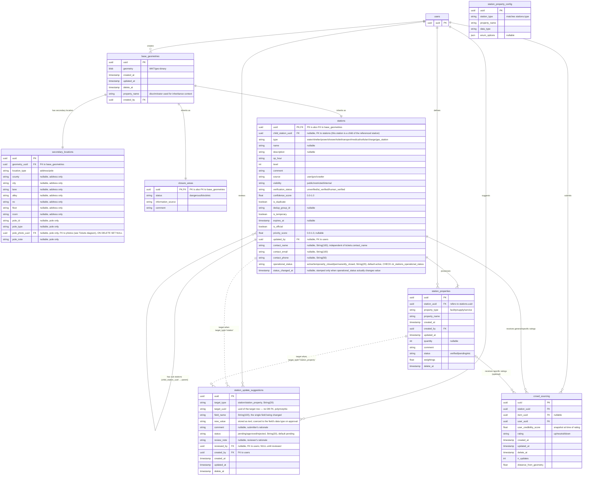
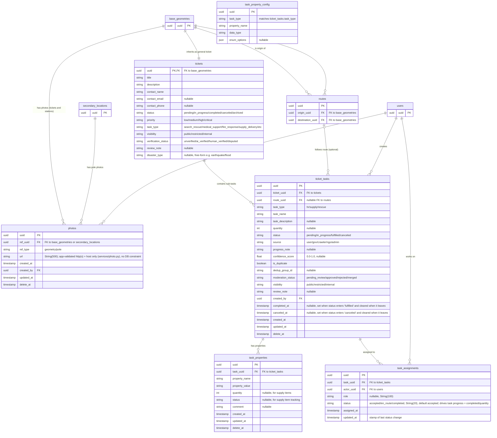

# ER Diagram

> Generated by Gemini Pro 3, updated to match alembic migrations (as of 2026-06-27).
> RBAC section replaced to match capability RBAC v1 — roles/permissions + teams + work zones,
> dropping the legacy Group/Policy engine (ADR-026, ER doc synced 2026-07-19 · ADR-062).
> Split into three diagrams below on 2026-08-06 — the single combined diagram had grown too
> large to read at a glance.
> `stations` gained its own `contact_name`/`contact_email`/`contact_phone` columns and
> `photos.ref_type='ticket'` was renamed to `'geometry'` (now covers both tickets and
> stations via `base_geometries.uuid`) on 2026-08-06.
> `stations` gained `operational_status`/`status_changed_at` and `ticket_tasks` gained
> `completed_at`, backing the analytics dashboard's station freshness-trend and ticket
> time-to-completion metrics, on 2026-08-07.
> Synced against `app/models/` and `alembic/versions/` on 2026-09-05: added the two tables
> that had shipped without ever being drawn (`notifications`, `station_update_suggestions`),
> `ticket_tasks.canceled_at` (the backlog-drain counterpart to `completed_at`), and two
> constraints that existed only in migrations — `uq_crowd_sourcing_user_item` and the
> `ix_work_zones_geometry` GIST index.
> `briefing_templates` / `briefings` (行前通知, migration `c3f0a1b2d4e6`) drawn in §3a of the
> Identity diagram on 2026-09-05, alongside the feature landing.

Tables that are owned by one diagram but referenced from another appear there as a
PK-only stub (name + `uuid PK` only, no other columns) so relationship arrows have
something to point at without duplicating the full column list:

| Table                 | Home diagram | Also appears (stub) in |
|------------------------|--------------|--------------------------|
| `users`                | Identity     | Geospatial, Tickets     |
| `base_geometries`      | Geospatial   | Tickets                 |
| `secondary_locations`  | Geospatial   | Tickets                 |

Note: `secondary_locations.pole_photo_uuid` is a FK to `photos` (home: Tickets), but —
matching the original combined diagram — it's documented only as a column comment, not
drawn as a relationship arrow, so `photos` doesn't need a stub in the Geospatial diagram.
`audit_logs.table_name`/`row_id` can reference a row in any table across all three
diagrams; it's a generic mutation trail (string column, no per-table FK), so it isn't
drawn as a relationship to every domain.

## 1. Identity, Auth & RBAC

Users, login/contact methods, capability-based RBAC (roles/permissions/teams/work
zones), the audit trail, announcements, the in-app notification feed, and pre-departure
notices (行前通知). Self-contained — no cross-domain stubs needed (nothing here depends on
Geospatial or Tickets).

```mermaid
erDiagram

%% ==========================
%% 1. Core Identity
%% ==========================
users {
    uuid uuid PK
    uuid team_uuid FK "nullable, FK to teams — a user belongs to at most one team (ADR-019)"
    string name "display nickname, not the login id, not unique"
    float credibility_score
    timestamp last_login_at "nullable"
    timestamp created_at
    timestamp updated_at
    timestamp delete_at
}

user_identities {
    uuid uuid PK
    uuid user_uuid FK "indexed"
    string provider "password/google/line, String(20)"
    string provider_subject "nullable, String(255)"
    string password_hash "nullable, String(512), only when provider=password"
    timestamp created_at
}
%% UNIQUE(provider, provider_subject) -- uq_identity_provider_subject
%% UNIQUE(user_uuid, provider)        -- uq_identity_user_provider
users ||--o{ user_identities : "logs in via"

user_contacts {
    uuid uuid PK
    uuid user_uuid FK "indexed"
    string type "email/phone, String(10)"
    string value "normalized (lowercase email / E.164 phone), String(320)"
    boolean verified "default false"
    timestamp verified_at "nullable"
    timestamp created_at
}
%% UNIQUE(type, value)      -- uq_contact_type_value (email/phone double as global login identifier)
%% UNIQUE(user_uuid, type)  -- uq_contact_user_type
users ||--o{ user_contacts : "reachable at"

%% ==========================
%% 2. RBAC v1 — capability-based roles/permissions + teams + work zones
%% Drop-and-replace of the legacy Group/Policy engine (ADR-026). Capability keys are
%% decoupled from DB tables (ADR-012); grants are additive/union with no deny (ADR-018).
%% ==========================

%% Functional role. kind = platform (one per user) or team (at most one per user, ADR-019).
roles {
    uuid uuid PK
    string name "UNIQUE, String(50)"
    string kind "platform/team, String(10)"
}

%% Capability catalog — one row per capability key (e.g. ticket.view, work_zone.assign).
permissions {
    uuid uuid PK
    string key "UNIQUE, String(80), e.g. ticket.view"
    string description "nullable, String(255)"
}

%% Role → permission grant, carrying the data-boundary scope (ADR-020/021).
role_permission_assign {
    uuid uuid PK
    uuid role_uuid FK "FK to roles, indexed"
    uuid permission_uuid FK "FK to permissions, indexed"
    string scope "none/own/team/gov/ngo/zone/all, String(10), default none"
}
%% UNIQUE(role_uuid, permission_uuid) -- uq_role_perm
roles ||--o{ role_permission_assign : "grants"
permissions ||--o{ role_permission_assign : "granted via"

%% User → role assignment (a person's platform/team role membership).
user_role_assign {
    uuid uuid PK
    uuid user_uuid FK "FK to users, indexed"
    uuid role_uuid FK "FK to roles, indexed"
}
%% UNIQUE(user_uuid, role_uuid) -- uq_user_role
users ||--o{ user_role_assign : "holds role"
roles ||--o{ user_role_assign : "assigned to"

%% User → permission direct grant (per-user override, additive/union with roles, ADR-018).
user_permission_assign {
    uuid uuid PK
    uuid user_uuid FK "FK to users, indexed"
    uuid permission_uuid FK "FK to permissions, indexed"
    string scope "none/own/team/gov/ngo/zone/all, String(10), default none"
}
%% UNIQUE(user_uuid, permission_uuid) -- uq_user_perm (ADR-058, feature 009 P3 / #27):
%% one direct grant per (user, permission); dedup keeps the widest scope.
users ||--o{ user_permission_assign : "directly granted"
permissions ||--o{ user_permission_assign : "granted to user"

%% --------------------------
%% 2a. Teams & Work Zones (ADR-019/021)
%% --------------------------
%% Organisation the user belongs to (gov/ngo). users.team_uuid points here (at most one).
teams {
    uuid uuid PK
    string name "String(100)"
    string type "gov/ngo, String(10)"
    string status "String(20), default active"
    string tax_id "nullable, String(8), 統一編號 (UBN)"
    timestamp created_at
    timestamp updated_at
    timestamp delete_at "nullable"
}
teams ||--o{ users : "has members (users.team_uuid)"

%% Geographic jurisdiction polygon; gov draws them and assigns to teams (ADR-021/049).
work_zones {
    uuid uuid PK
    string name "String(100)"
    blob geometry "MultiPolygon, SRID 4326, nullable"
    uuid created_by FK "nullable, FK to users"
    timestamp created_at
    timestamp updated_at
    timestamp delete_at "nullable"
}
%% INDEX: ix_work_zones_geometry ON work_zones USING GIST (geometry) -- every `zone` scope check
%% is an ST_Contains against this column, so it must not sequentially scan.
users ||--o{ work_zones : "draws"

%% Team ↔ work zone assignment. A team's `zone` scope = resources whose geometry falls
%% inside a work zone assigned to it (ST_Contains, ADR-028). Geo resources are NOT
%% org-owned: base_geometries has NO team_uuid — jurisdiction is purely geographic (ADR-049).
team_zone_assign {
    uuid uuid PK
    uuid team_uuid FK "FK to teams, indexed"
    uuid zone_uuid FK "FK to work_zones, indexed"
    timestamp created_at "when the delegation was made"
    uuid assigned_by FK "FK to users, who delegated it"
}
%% UNIQUE(team_uuid, zone_uuid) -- uq_team_zone
%% created_at/assigned_by are denormalised from audit_logs for cheap display; audit_logs
%% remains the source of truth for delegation history, including removals.
teams ||--o{ team_zone_assign : "assigned zones"
work_zones ||--o{ team_zone_assign : "assigned to teams"
users ||--o{ team_zone_assign : "assigned by"

%% ==========================
%% 3. Audit Log, Announcements, Notifications & Pre-Departure Notices
%% ==========================
audit_logs {
    uuid uuid PK
    string table_name "table that was mutated"
    string action "INSERT/UPDATE/DELETE"
    uuid row_id "PK of the mutated row"
    jsonb old_values "nullable"
    jsonb new_values "nullable"
    uuid user_uuid "nullable, logical ref to users (no DB FK)"
    string client_ip "nullable"
    timestamp created_at
}
%% Dashed = non-identifying logical reference; user_uuid is a plain UUID column, not an
%% enforced FK. table_name/row_id can point at any table in any of the domain diagrams —
%% audit_logs is a generic mutation trail, not modeled with per-table FKs.
users ||..o{ audit_logs : "acted (logical)"

announcements {
    uuid uuid PK
    uuid created_by FK "FK to users"
    boolean active
    int display_order "nullable; non-null iff active and not deleted; unique among live (app-enforced)"
    text content
    timestamp created_at
    timestamp updated_at
    timestamp delete_at
}
users ||--o{ announcements : "authors"

%% In-app notification feed — one row per (recipient, event), not one per event.
%% NotificationService.dispatch() fans an event out over a resolved recipient list and
%% always drops the actor from it, so nobody is notified of their own action.
%% type values: announcement_published, zone_assigned, zone_unassigned, team_member_added,
%%   ticket_task_status_update, ticket_task_moderation_update, task_assignment_created,
%%   resource_station_updated, dedup_flag_ticket, dedup_flag_station
notifications {
    uuid uuid PK
    uuid recipient_uuid FK "FK to users, ON DELETE CASCADE"
    uuid actor_uuid FK "nullable, FK to users, ON DELETE SET NULL; NULL = system-triggered"
    string type "String(50), see the value list above"
    string priority "urgent/high/medium/info, String(20), default medium"
    string ref_type "nullable, String(50): announcement/work_zone/team/ticket_task/station"
    uuid ref_uuid "nullable, uuid of the ref_type row — no DB FK, same polymorphic pattern as photos"
    string title "String(200)"
    text body
    boolean read "default false"
    timestamp read_at "nullable"
    timestamp created_at
    timestamp updated_at
    timestamp delete_at
}
%% ref_type/ref_uuid keep the frontend URL out of the row: the client resolves the target
%% itself, so a route change doesn't invalidate stored notifications.
%% INDEX: ix_notifications_recipient_unread  ON (recipient_uuid, read, delete_at) -- unread badge count
%% INDEX: ix_notifications_recipient_created ON (recipient_uuid, created_at)      -- feed pagination
users ||--o{ notifications : "receives"
users ||--o{ notifications : "triggered (actor)"

%% --------------------------
%% 3a. Pre-Departure Notices (行前通知) — briefing templates and generated briefings
%% --------------------------
%% Admin-authored volunteer guidance, shaped like announcements: created_by, soft delete,
%% and a public read (pre_departure.view is in PUBLIC_PERMS — a volunteer reads this to
%% decide whether to show up, so it can't require an account).
%% `state` is the deployment-lifecycle phase the material targets.
briefing_templates {
    uuid uuid PK
    text content
    jsonb tags "string array, server_default '[]'; free-form categorization (psychological/supply/disaster-type)"
    string state "briefing 行前 / in_field 現場 / debrief 回程後, String(50), default briefing"
    uuid created_by FK "FK to users, indexed"
    timestamp created_at
    timestamp updated_at
    timestamp delete_at
}
users ||--o{ briefing_templates : "authors"

%% A briefing generated from a template, or authored ad-hoc.
briefings {
    uuid uuid PK
    uuid template_uuid FK "nullable, FK to briefing_templates, indexed"
    text content
    jsonb tags "string array, server_default '[]'"
    string state "briefing/in_field/debrief, String(50), default briefing"
    uuid created_by FK "FK to users, indexed"
    timestamp created_at
    timestamp updated_at
    timestamp delete_at
}
%% template_uuid is nullable for two reasons, not one: an ad-hoc briefing never had a
%% template, and content/tags/state are COPIED at generation time rather than joined — so
%% soft-deleting a template leaves existing briefings whole, and later edits to a template
%% deliberately do not rewrite briefings already sent out.
%% `tags` is queried with JSONB containment (`tags @> '["x"]'`), not a join table: the tag
%% vocabulary is meant to grow without a migration.
briefing_templates ||--o{ briefings : "generated from"
users ||--o{ briefings : "authors"
```

## 2. Geospatial & Stations

Base geometries, secondary locations, closure areas, stations, station properties,
crowd-sourced ratings, and the user-suggestion → admin-review queue for station edits.
`users` appears below as a PK-only stub for `created_by`/`user_uuid` references — full
definition in the Identity diagram above.

## 3. Tickets, Tasks & Routes

Tickets, photos, routes, and unified sub-tasks. `users`, `base_geometries`, and
`secondary_locations` appear below as PK-only stubs for cross-domain references —
full definitions in the Identity / Geospatial diagrams above.

