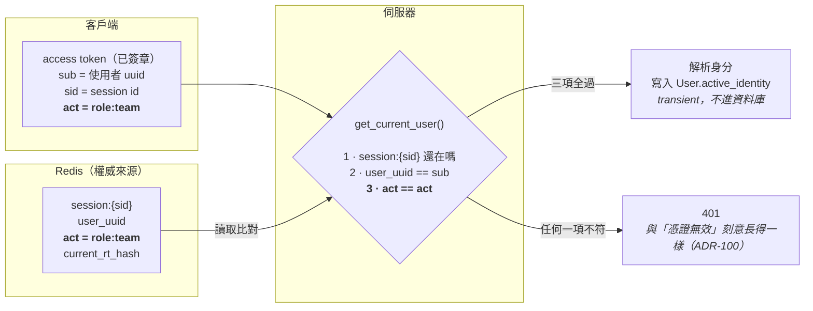
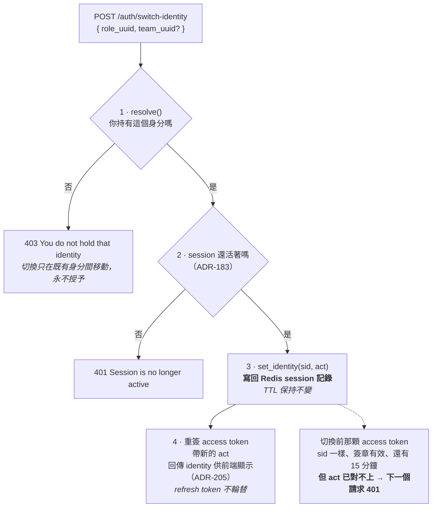
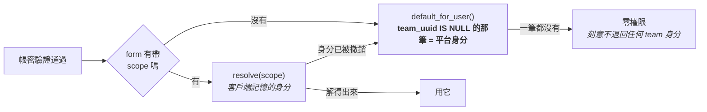
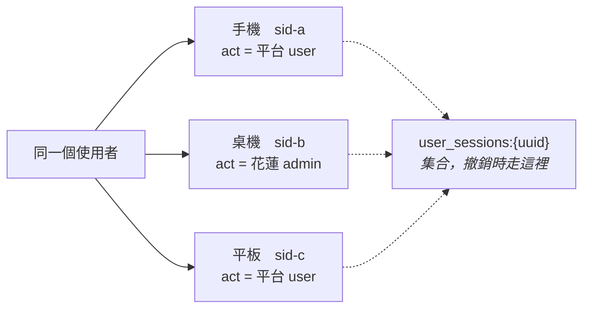
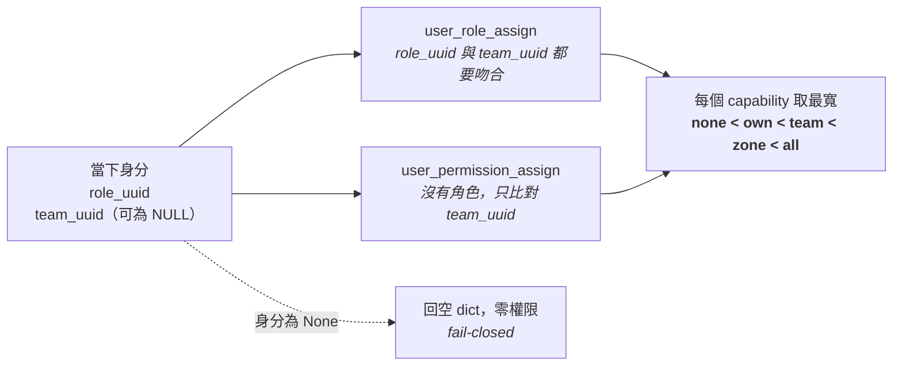

# 身分切換與 `act` 校驗

> Feature 010（多 team 身分切換）的完整流程。以 `feat/multi-team-membership-backend` 分支的**實際程式碼**逐條確認，非設計稿轉述。
>
> 相關 ADR：068 · 069 · 070 · 073 · 096 · 183 · 188 · 195 · 205

一個人可以持有多個身分、可以同時在多個裝置登入，而**每個請求只作用於其中一個身分**。

---

## 1. 核心機制：身分存在兩個地方，兩個都要對得上

身分不是「JWT 帶什麼就是什麼」。access token 的 `act` claim 是**攜帶**身分，Redis 的 session 記錄才是**權威來源**。



**`act` 的內容是 `role_uuid:team_uuid`**，不是授權列的主鍵。這樣即使那筆授權被刪掉再加回來、或角色被改名，這個值仍然指得到同一個身分。

第 3 道檢查是整份設計的支點：它讓切換**立刻生效**，也讓舊 token **無法重放**回切換前的身分。

---

## 2. 切換：`POST /auth/switch-identity`

切換身分**不是憑證事件**。不輪替 refresh token、不延長 session 壽命、不要求重新登入。



### 為什麼第 3 步不能省

沒有它，切換只活在回傳的那顆 token 裡。切換前的 token 還有 15 分鐘壽命，重放它就能：

- **撤銷一次刻意的降級**（super_admin 切成 team member 後，重放舊 token 就變回 super_admin）
- 而且稽核軌跡會把那些操作**記在切換前的身分名下**（ADR-195）

### 為什麼切換不設權限門檻

這個端點**只要求登入，不要求任何 capability**。要求了反而危險：使用者可能降級進入一個「無權切換」的身分，把自己鎖在外面再也回不去（ADR-070）。

### 為什麼要檢查 session 還活著

這個端點會發出**全新到期時間**的 access token。少了這道檢查，它就是一個「只要手上 token 還沒過期就能無限續命」的續期器——`logout` / `logout-all` 之後 `/auth/refresh` 會正確拒絕，但在每次過期前呼叫這支就能讓已撤銷的 session 永遠活著（ADR-183）。它也因此跟 `login`、`refresh` 一樣有 rate limit。

---

## 3. 登入時的身分從哪來：`POST /auth/login`

身分存在 session 記錄裡，而**每次登入都建立新的 session**。所以換裝置登入時，伺服器沒有任何「上次切到哪」可以繼承——**記住上次身分是客戶端的責任**。



- 客戶端可在 OAuth2 form 的 `scope` 欄位帶上它記得的身分（ADR-069）
- 帶了但該身分已被撤銷時**不報錯**，退回預設；回應會說明最後落在哪個身分，客戶端因此看得出自己的記憶過期了（ADR-205）
- `default_for_user()` 取 `team_uuid IS NULL` 的那筆。註冊時給 `user`，之後每次授予平台角色是**取代**而非新增，所以正常帳號恰好一筆
- 一筆都沒有時回 `None`（零權限），**刻意不退回任何 team 身分**——把人放到他沒有選擇的 team 身分上，正是 ADR-096 否決的「無聲降級」

---

## 4. 多裝置



| 行為 | 結果 |
|---|---|
| 同時多裝置登入 | ✅ 每次登入一個獨立 session |
| 各裝置停在不同身分 | ✅ 手機是 team member、桌機是 super_admin，互不影響 |
| 在 A 裝置切換 | 只改那一個 sid 的記錄，**B 裝置不受影響** |
| `logout-all` / 管理員踢人 | 走 `user_sessions` 集合，**全部一起撤銷** |

### 為什麼不做成使用者層級的「上次身分」

1. A 裝置的降級會跟著降低 B 裝置的權限；反過來 A 裝置切回高權限也會讓 B 裝置突然升權
2. `act` 同時是**安全邊界**——它跟 session 綁死才擋得住舊 token 重放（第 1 節第 3 道檢查）

真要跨裝置記憶，正解是存一個**建議值**，只在客戶端沒帶 `scope` 時當預設，不覆寫 session 這個權威來源。那是一張獨立的票。

---

## 5. 權限解析：只有當下這個身分的授權算數

切換是**真的**，不是裝飾。super_admin 切成某 team 的成員後，只剩該成員的權限。



實際的過濾條件（`auth_repository.get_user_permissions`）：

```python
UserRoleAssign.role_uuid == identity.role_uuid
UserRoleAssign.team_uuid.is_not_distinct_from(identity.team_uuid)
```

聯集仍然存在，但**只在單一身分之內**：該身分的角色授權 ∪ 綁在同一個 team 的直接授權，每個 capability 取最寬的 scope。其他身分的授權**連查都查不到**。

---

## 6. 常被問到的 vs 實際上是

| 常被問到的 | 實際上是 |
|---|---|
| scope 有 `gov` / `ngo` 兩個值嗎 | **沒有**。scope 只有 `none / own / team / zone / all`。`gov` 與 `ngo` 是 `teams.type` 欄位，不是 scope |
| 一人多身分時該套哪個 scope | 只套當下身分的。授權查詢以 `(role_uuid, team_uuid)` 過濾，其他身分的不在結果裡 |
| 「目前身分」後端有存嗎 | **有**。Redis session 記錄的 `act` 是權威來源，token 的 `act` 必須與它相等 |
| 切換要重新登入嗎 | **不用**。只重簽 access token，refresh token 不輪替，session TTL 不變 |
| 換裝置會回到上次的身分嗎 | **不會**。新裝置 = 新 session，除非客戶端登入時自己用 `scope` 帶上來 |
| `teams.contact` 沒填時 NGO 看到什麼 | 這個欄位**不存在**。`teams` 只有 `uuid / name / type / status / tax_id / created_at / updated_at / delete_at` |

---

## 7. 撤銷：三種讓身分作廢的方式

| 端點 | 範圍 | 備註 |
|---|---|---|
| `POST /auth/logout` | 只有當前 sid | 其他裝置不受影響 |
| `POST /auth/logout-all` | 該使用者的**每一個** session | 使用者 uuid 取自 **session 記錄**而非 token 的 `sub`——這是撤銷範圍最大的端點，最不該把 uuid 當可信輸入（ADR-223） |
| `POST /admin/users/{uuid}/revoke-sessions` | 目標使用者的全部 session | 寫一筆 audit row 記錄是誰踢的。Redis 不可用時回 503 而非 500，且訊息不宣稱「一筆都沒撤銷」——撤銷是逐筆進行的，中途失敗時前面幾筆已經沒了（ADR-222） |

---

## 程式碼落點

| 主題 | 位置 |
|---|---|
| `ActiveIdentity` 與 `act` 的編碼 | `app/core/identity.py` |
| 三道檢查 | `app/core/security.py` 的 `get_current_user` |
| 權限解析 | `app/core/security.py` 的 `resolve_scope` → `auth_repository.get_user_permissions` |
| 登入 / 切換 / refresh / logout | `app/api/v1/endpoints/auth/session.py` |
| session 記錄與 `set_identity` | `app/repositories/session_repository.py` |
| 身分解析與預設身分 | `app/repositories/active_identity_repository.py` |
| scope 定義與「最寬者勝」 | `app/core/rbac_scopes.py` |

## 修掉的文件缺陷

`app/models/team.py` 對 `type` 欄位的註解原本寫著 `# "gov" | "ngo" — drives gov/ngo scope`——舊設計的殘留字句，與現行 scope 定義不符，正是「scope 有四個值」這個誤解的來源。已於本次一併更正為「這是組織種類，不是 scope；兩種都走 `team` scope」。
