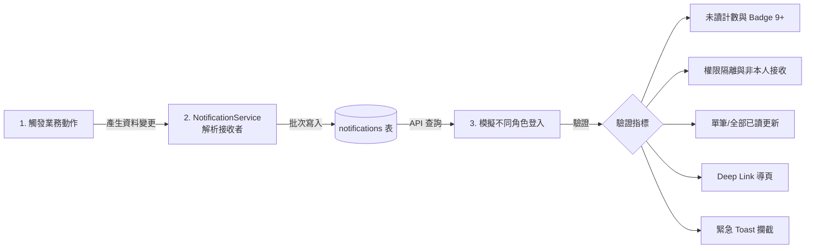

# Notification System — End-to-End Test Plan (通知系統端對端測試計畫書)

| 欄位 | 說明 |
|---|---|
| 文件狀態 | Ready for Testing |
| 依據規格 | [Notification_System_PRD.md](file:///Users/kaijenz/optimized-version/Notification_System_PRD.md) & [Notification_System_Implementation_Plan.md](file:///Users/kaijenz/optimized-version/Notification_System_Implementation_Plan.md) |
| 目標版本 | MVP |
| 測試範圍 | 資料庫寫入、對象解析、FastAPI 端點、前端 UI/UX (小鈴鐺/面板/Toast)、權限隔離、資料保留 |

---

## 1. 測試目標與架構 (Test Objectives & Framework)

本測試計畫旨在驗證通知系統的完整端對端流程（從**業務事件觸發**、**寫入時接收者解析**、**API 查詢與已讀更新**，到**前端介面互動與 Toast 提示**）。



---

## 2. 測試角色矩陣與預置假資料 (Test Persona Matrix)

為了完整測試權限隔離與不同的通知 Scope，預設建立以下 5 位測試人員：

| 假使用者名稱 | 角色 (Role) | 團隊類型 | 測試職責與預期接收範圍 |
|---|---|---|---|
| **Alice (陳隊長)** | `ngo_admin` | NGO 團隊 (搜救隊) | 接收工作區指派 (`urgent`)、責任區物資站異動、全站公告 |
| **Bob (林志工)** | `ngo_member` | NGO 團隊 (搜救隊) | **不收**工作區指派；僅接收個別任務派工 (`task_assignment`)、全站公告 |
| **Charlie (王專員)** | `gov_admin` | Gov 團隊 (應變中心) | 接收全域物資站狀態更新、全站公告 |
| **David (張民眾)** | `user` / `volunteer` | 一般志工/民眾 | 接收個人通報狀態更新、全站公告 |
| **Eve (李審核員)** | `data_auditor` | 具備 `dedup.ticket.manage` | 接收重複工單待審核通知 (`dedup_flag_ticket`) |

---

## 3. 測試層級與工具 (Test Modalities)

測試將分為三個層次進行：

1. **Level 1：全自動化 Pytest 測試套件**
   * 檔案位置：`Backend/tests/test_notifications_e2e.py`
   * 執行方式：一鍵指令自動跑完所有斷言。
2. **Level 2：假資料播種腳本 (Mock Data Seeding)**
   * 檔案位置：`Backend/scripts/seed_fake_notifications.py`
   * 用途：在開發環境資料庫注入逼真假資料，供 Swagger UI (`/docs`) 或 Postman 呼叫。
3. **Level 3：前端瀏覽器人工驗收清單 (UI/UX Checklist)**
   * 驗收項目：小鈴鐺未讀紅點、9+ 樣式、下拉面板無限滾動、優先級顏色飾條、緊急 Toast、Deep Link 導頁。

---

## 4. 詳細端對端測試案例 (Detailed E2E Test Cases)

### 🧪 TC-01: 工作區指派與權限隔離測試 (Zone Assignment & Role Isolation)
* **測試目的**：驗證 `zone_assigned` 為 `urgent` 優先級，且**只有** NGO Admin 會收到，同隊 Member 不會收到。
* **前置動作**：建立搜救隊，指派 Alice 為 `ngo_admin`，Bob 為 `ngo_member`。
* **觸發動作**：後端呼叫分派工作區邏輯 (`TeamZoneService.assign_zone`)。
* **預期結果**：
  1. `notifications` 表新增一筆記錄，`recipient_uuid = Alice.uuid`，`priority = 'urgent'`。
  2. 模擬 Alice 呼叫 `GET /unread-count` ➔ 回傳 `unread_count: 1`, `has_urgent: true`。
  3. 模擬 Bob 呼叫 `GET /unread-count` ➔ 回傳 `unread_count: 0`, `has_urgent: false`（成功隔離）。
  4. Alice 前端畫面上載入時跳出【緊急工作區指派】Toast 快訊。

---

### 🧪 TC-02: 任務指派通知與個人關聯 (Task Assignment Flow)
* **測試目的**：驗證管理員派工給成員時，該成員會收到 `task_assignment_created` 通知。
* **前置動作**：Alice 建立工單任務「和平國小物資發放」。
* **觸發動作**：Alice 將任務指派給 Bob (`TaskAssignmentService.create_assignment`)。
* **預期結果**：
  1. Bob 收到通知：標題為「📋 您有新的任務指派」，`priority = 'high'`，`ref_type = 'ticket_task'`。
  2. Alice (觸發者本人) **不會**收到通知 (Actor Exclusion 邏輯正確)。
  3. Bob 點擊該通知，前端自動開啟該工單任務的詳細資訊抽屜。

---

### 🧪 TC-03: 去重複審核通知 (Dedup Management Flagging)
* **測試目的**：驗證 `dedup_flag_ticket` 與 `dedup_flag_station` 僅發送給持有對應權限的使用者。
* **前置動作**：Eve 具備 `dedup.ticket.manage` 權限；David 無該權限。
* **觸發動作**：系統將工單標記為重複 (`ticket_task.is_duplicate = true`)。
* **預期結果**：
  1. Eve 呼叫 `GET /notifications` 看到「重複工單待審核」通知。
  2. David 呼叫 `GET /notifications` 看不到此通知。

---

### 🧪 TC-04: 物資資源站異動通知 (Resource Station Update)
* **測試目的**：驗證資源站異動時，全體 Gov 人員與該責任區 NGO Admin 皆會收到。
* **前置動作**：花蓮體育館物資站位於 Alice 搜救隊的指派責任區內。
* **觸發動作**：站點更新「飲用水儲備量不足」。
* **預期結果**：
  1. Charlie (`gov_admin`) 收到「🏢 資源物資站狀態更新」通知。
  2. Alice (`ngo_admin`) 亦收到該站點狀態更新通知（因責任區重疊）。
  3. 其他無關區域的 NGO 不會收到。

---

### 🧪 TC-05: 全站公告發布 (Global Announcement)
* **測試目的**：驗證公告發布時，全體活躍用戶 (`scope: all`) 皆會收到廣播通知。
* **觸發動作**：管理員發布新公告「中央應變中心二級開設」。
* **預期結果**：
  1. Alice、Bob、Charlie、David、Eve 每位使用者的 `unread_count` 皆增加 1。

---

### 🧪 TC-06: 未讀計數與 Badge (1~9, 9+) 視覺驗收
* **測試目的**：驗證前端頂端導覽列小鈴鐺圖示與 Badge 數字邊界。
* **測試情境**：
  * 0 筆未讀 ➔ Badge 隱藏不顯示。
  * 1~9 筆未讀 ➔ 顯示精確數字（如 `1`, `5`, `9`）。
  * 10 筆以上未讀 ➔ 顯示 `9+`。

---

### 🧪 TC-07: 單筆點擊已讀與 Deep Linking 導頁
* **測試目的**：驗證點擊通知後的狀態流轉與路由跳轉。
* **測試步驟**：
  1. 使用者點擊下拉面板中任一則未讀通知。
  2. 前端立即發送 `PATCH /api/v1/notifications/{uuid}/read`。
  3. 該列由粗體變為一般字體，未讀計數即時 -1。
  4. 依據 `ref_type` 跳轉：
     * `work_zone` ➔ 導航至地圖並自動置中於該工作區。
     * `ticket_task` ➔ 開啟工單詳情。
     * `station` ➔ 開啟物資站詳情。
     * `announcement` ➔ 彈出公告對話框。

---

### 🧪 TC-08: 全部標示為已讀 (Mark All as Read)
* **測試目的**：驗證一鍵清空未讀通知功能。
* **測試步驟**：
  1. 面板中有 5 則未讀通知（包含 1 則 urgent、4 則 normal）。
  2. 點擊面板頂部「全部標示為已讀」按鈕。
  3. 前端未讀紅點立即消失，右下角彈出 Toast「已將所有通知標示為已讀」。
  4. 背景呼叫 `PATCH /api/v1/notifications/read-all` 成功。
  5. 重新整理網頁，未讀數依然維持 0。

---

### 🧪 TC-09: 輪詢與分頁切換焦點強制刷新 (Polling & Focus Refresh)
* **測試目的**：驗證前端不會浪費請求，但在必要時刻即時刷新。
* **測試步驟**：
  1. 開啟瀏覽器 Network 面板，確認分頁活躍時每 30 秒發送一次 `GET /unread-count`。
  2. 切換至其他應用程式/分頁（分頁進入 background） ➔ 確認輪詢暫停。
  3. 切回本系統分頁 ➔ 確認立刻發送一次 `GET /unread-count`。
  4. 點擊進入 `/map` 或 `/tickets` 頁面 ➔ 確認立刻觸發刷新。

---

### 🧪 TC-10: 資料保留排程清理驗證 (Retention Cleanup)
* **測試目的**：驗證定時任務會正確軟刪除過期通知。
* **測試步驟**：
  1. 資料庫預置三筆資料：
     * 筆 1：已讀超過 31 天。
     * 筆 2：未讀超過 91 天。
     * 筆 3：未讀 5 天。
  2. 執行清理函數 `cleanup_expired_notifications()`。
  3. 驗證 筆 1 與 筆 2 的 `delete_at` 已被填入時間（軟刪除），筆 3 的 `delete_at` 仍為 NULL。
  4. 呼叫 `GET /notifications` 驗證筆 1 與 筆 2 不會再出現在列表中。

---

## 5. 測試操作手冊與執行指令 (Execution Guide)

### 步驟 1：執行全自動化 Pytest 測試
```bash
# 進入 Backend 目錄並執行通知模組 E2E 測試
cd /Users/kaijenz/optimized-version/Backend
pytest tests/test_notifications_e2e.py -v
```

### 步驟 2：執行假資料播種腳本 (手動測試前置)
```bash
# 在本機資料庫生成各角色與假通知
python scripts/seed_fake_notifications.py
```

### 步驟 3：透過 Swagger UI 驗證 API
1. 啟動後端伺服器：
   ```bash
   uvicorn app.main:app --reload --port 8000
   ```
2. 開啟瀏覽器至 `http://localhost:8000/docs`。
3. 測試以下端點：
   * `GET /api/v1/notifications/unread-count`
   * `GET /api/v1/notifications?page=1&page_size=20`
   * `PATCH /api/v1/notifications/{uuid}/read`
   * `PATCH /api/v1/notifications/read-all`

### 步驟 4：啟動前端進行 UI 驗收
1. 啟動前端開發伺服器。
2. 分別以 `Alice (NGO Admin)`、`Bob (NGO Member)` 與 `Charlie (Gov Admin)` 帳號登入。
3. 按照第 4 節的 **TC-01 至 TC-09** 逐項核對畫面表現。

---

## 6. 測試驗收簽核表 (Sign-off Checklist)

| 測試案例 ID | 測試項目 | 測試人員 | 通過狀態 (Pass/Fail) | 備註 |
|---|---|---|---|---|
| **TC-01** | 工作區指派與權限隔離 (Urgent Toast) | | [ ] | |
| **TC-02** | 志工任務指派與 Actor 排除 | | [ ] | |
| **TC-03** | 去重複權限篩選 | | [ ] | |
| **TC-04** | 資源站狀態更新通知 | | [ ] | |
| **TC-05** | 全站公告廣播 | | [ ] | |
| **TC-06** | Badge 未讀數字與 9+ 樣式 | | [ ] | |
| **TC-07** | 單筆點擊已讀與 Deep Linking | | [ ] | |
| **TC-08** | 全部標示為已讀與 Toast 提示 | | [ ] | |
| **TC-09** | 30s 輪詢與焦點強制刷新 | | [ ] | |
| **TC-10** | 30/90 天資料保留排程軟刪除 | | [ ] | |
