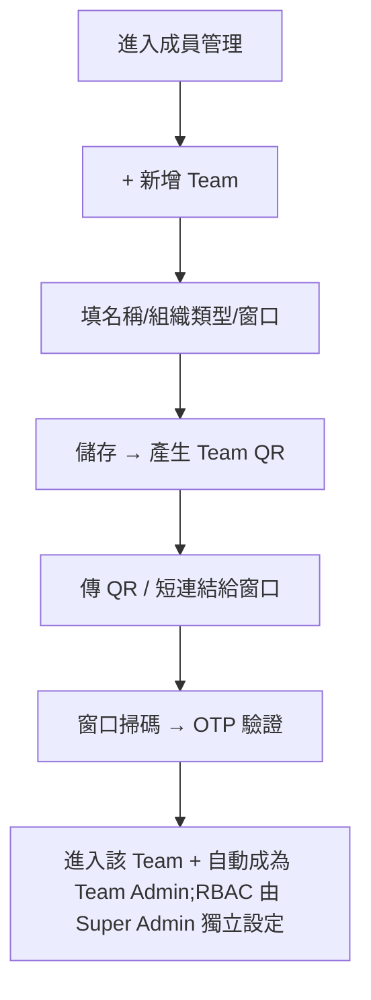
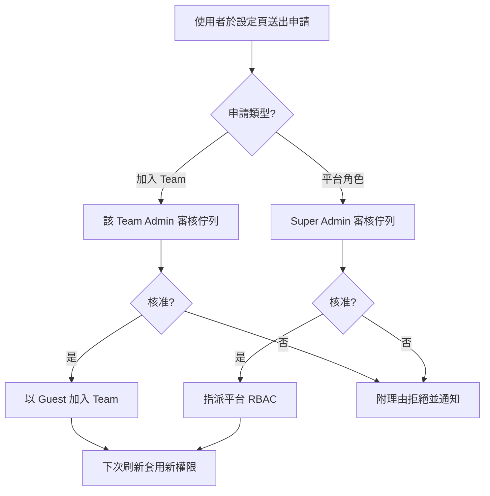

# Feature PRD — 成員管理 (Member Management)

> **版本：** v5.0
> **日期：** 2026-06-15
> **狀態：** Definition Phase
> **根基文件：** [`user-stories.md`](user-stories.md)（角色、情境、使用者目標——請先讀這份）
> **關聯文件：** [[04-rbac]]（平台 RBAC 角色與權限矩陣）、[[03-user-settings]]（申請入口）、`research/qr-invitation-security-patterns.md`、`research/guest-restricted-access-patterns.md`

> 本文件是由 [`user-stories.md`](user-stories.md) **推導出的功能規格**（如何實作）。正文只寫目前定案的規格;角色與情境見根基文件,版本演進見文末變更紀錄,平台 RBAC 的權限模型見 [[04-rbac]] 不重述。

---

## 1. 範圍與邊界

本文件負責**「人與團隊的管理操作流程」**:建立團隊、管理成員、邀請、切換、審核、稽核。

**不負責**平台 RBAC 的權限模型——角色定義、權限矩陣、平台級不變量一律定義在 [[04-rbac]],本文件需要時引用,不重述。

涉及三個正交維度,閱讀時請隨時區分:

| 維度 | 定義在哪 | 可能值 | 決定什麼 |
|------|----------|--------|----------|
| 平台 RBAC | **[[04-rbac]]** | Super Admin / Government / NGO / Data Auditor / 一般使用者 | 全域能做什麼動作、看哪些全域資料 |
| Team(協作空間) | 本文件 | 0~N 個 | 資料隔離的容器 |
| Team 內角色 | 本文件 | Admin / Member / Guest(每 Team 獨立) | 在某 Team 內能否管理成員清單 |

**三條鐵則:**
1. **RBAC 與 Team 正交**——任何 RBAC 角色都可以有 Team 或沒有 Team;Team 不限制成員的 RBAC。
2. **NGO ≠ Team Admin**——NGO 是 RBAC 身份,Team Admin 是 Team 內角色。NGO 成員在 Team 內可能是 Admin / Member / Guest;非 NGO 的人也能當某 Team 的 Admin。
3. **Team 內可見性由 Team 內角色決定,與 RBAC 無關**(Super Admin 全域可見為唯一例外)。

> **後台可見範圍 = RBAC 全域範圍 ∪ 所屬 Team 空間範圍**(此存取推導原則的權威定義見 [[04-rbac]])。因此一般使用者(全域範圍 = ∅)一旦被邀進某 Team 就進得了後台,但畫面收斂成只剩那一個 Team。

---

## 2. 介面與導覽(IA)

> 決策日 2026-06-15。對齊「RBAC 與 Team 正交」原則:**兩個維度在介面上各有自己的家**,不再把 Team 埋在單一「成員管理」模組的分頁底下(原型 HTML 的舊作法)。

* **`Teams`(獨立導覽項)** — 協作空間視角:Team 列表 + 該 Team 詳情 + 成員名單 + 邀請/暫停/解散/認領 Zone。回答「有哪些協作空間、各自的成員與責任區」。對應功能需求 **A. Team 管理**。
* **`成員與權限`(獨立導覽項)** — 平台身份視角:平台 RBAC 的指派入口、平台級人員(無 Team 的 Super Admin / Data Auditor)、全平台人員唯讀搜尋。回答「這個人是誰、平台身份是什麼、現在在哪些 Team」。對應 **B. RBAC 操作入口**(規則見 [[04-rbac]])。
* **審核佇列 = 頂欄全域 inbox** — 因橫跨三種申請、reviewer 不同(平台角色→Super Admin、加入 Team→Team Admin、QR 待確認→Team Admin),不綁在任一模組分頁,改為頂欄通知中心 🔔 + 對應位置徽章。對應 **C1. 審核佇列**。
* **角色導向收斂** — 各 RBAC 看到的入口依權限收斂:Team Admin 主要落在「我的團隊」;Government 在 `Teams` 只見唯讀列表+窗口;一般使用者/訪客後台收斂為單一 Team(見 A5)。

```
側邊欄                         頂欄
 ├ 地圖 / 任務 / 資源…          🔔 審核佇列(全域 inbox)
 ├ Teams        ← A. Team 管理
 └ 成員與權限   ← B. RBAC 操作入口(規則見 04)
```

> **待對齊設計(現有 Figma / 原型的漂移):**
> 1. Figma `User Management` 為舊單軸模型(Role 下拉含 `Volunteer`、缺 `Data Auditor`、無 Team)——需依本節 IA 與兩軸模型重畫。
> 2. 取消 Figma 式「每列 inline Role 下拉」:改 RBAC 須為刻意動作(僅 Super Admin、重新驗證、寫 Audit、通知當事人,見 [[04-rbac]]),不是隨手下拉。
> 3. 原型 HTML 的約束代碼需同步命名:`E1`(Team 至少 1 位 Admin)對應本 PRD §4 的 `EA1`;`E8`(平台至少 1 位 Super Admin)屬平台 RBAC 不變量,**v5.0 起已移交 [[04-rbac]] 維護**,本 PRD 不再保留 `EB` 編號,引用時直接指向 [[04-rbac]] 對應約束。
> 4. 原型把「訪客」以「RBAC=一般使用者被邀入」表現,需與 Team 內角色 `Guest`(A2)的視覺一致化。

---

## 3. 功能需求

### A. Team 管理

> 本區塊操作都在 Team 維度內,**不變更任何人的平台 RBAC**。

#### A1. Team 列表與 CRUD
* **列表欄位:** Team 名稱、組織類型(NGO/政府/其他)、狀態(active/suspended/inactive)、成員數、聯絡窗口、建立時間。
* **可見性:** Super Admin 全部可編輯｜Government 見列表+窗口(唯讀、別家)｜Team Admin 見自己所屬 Team｜Team Member 見自己 Team 基本資訊｜Data Auditor 不顯示此頁。
* **建立(限 Super Admin):** 必填名稱、組織類型;選填統編、窗口、預設責任區。建立後自動產生 Team 邀請 QRCode。**禁止同名**(避免派單/劃區混淆)。
* **編輯:** Super Admin 改全部;Team Admin 僅改自家的窗口與描述。每 Team 至多 1 位主要聯絡窗口。
* **暫停 / 解散(限 Super Admin,均需附理由):**
  * 暫停 = 暫停存取、資料保留、可恢復。
  * 解散 = 標記歷史、**不刪除**,原 Ticket/Zone 保留並標「來源 Team 已解散」。
  * 解散只移除「該 Team 歸屬」,不影響成員在其他 Team 的身份;若是某成員唯一的 Team,該成員回退為「無 Team」(RBAC 不變,見 EA4)。

#### A2. Team 成員管理(Team 內角色)
* **列表欄位:** 姓名、本 Team 角色(Admin/Member/Guest)、狀態、加入/最後活動時間。
* **可見性:** Super Admin 全部｜該 Team 的 Admin 見該 Team 成員｜該 Team 的 Member 見成員基本資訊(不含 Audit Log)｜Government / Data Auditor **完全看不到別家 Team 成員頁**。
* **角色變更(Team Admin,限自家):** Member↔Admin 升降、Guest→Member(解除唯讀、允許回報)。**僅影響 Team 內角色,不動平台 RBAC。** 約束:每個 active Team 至少 1 位 Admin(見 EA1)。Super Admin 可跨 Team 變更。
* **Team 內帳號狀態:** Team Admin 可暫停成員「在本 Team」的活動;僅影響該 Team,不影響其他 Team 或整個帳號(全域帳號暫停見 B3)。

#### A3. QRCode 邀請
* **Team 邀請 QR(限 Super Admin 產生):** 內含一次性 token + Team ID,預設有效 72 小時。第一個掃碼者進入該 Team 並自動成為**該 Team 的 Admin**;其平台 RBAC 由 Super Admin 在建立 Team 時獨立設定(建 NGO 類型 Team 可便利預填 NGO,但 RBAC 與 Team 仍分開、可獨立調整)。後續掃碼者進「待 Team Admin 確認」佇列。
* **成員邀請 QR(Team Admin 產生):** 內含 token + Team ID + 預設角色 Member,預設有效 24 小時,可多人使用(預設上限 50)。掃碼者以 Member 加入。
* **邀請短連結:** QR 旁附可複製短連結(如 `wanguard.tw/i/abc123`),與 QR 共享同 token,方便傳 LINE。
* **安全機制:**
  * **強制 OTP**:掃 QR → 填手機 → 收簡訊 OTP → 完成。偏鄉/災區收不到簡訊時,備援 Email OTP 或轉「Team Admin 手動核准佇列」。
  * **撤銷 / 輪替**:Admin 可一鍵撤銷或 rotate 已產生的連結與 QR。
  * **敏感團隊把關**:含 Government 或設為敏感的團隊,禁「掃碼即入」,一律進確認佇列。
  * **防誤觸**:`GET` 連結只載入資訊頁(不消耗 token),按「確認加入」送 `POST` 才消耗。
  * **Pending 清理**:掃碼後逾 24 小時未完成 OTP 的 `pending` 帳號,由排程自動清除。

#### A4. Team 切換(一人多 Team)
* 一人可加入 0~N 個 Team,登入後/頁首提供「切換團隊」。
* 切換後資料邊界(Ticket/Zone/成員清單/Audit Log)以當前 Team 為準;該人在各 Team 的 Team 內角色各自獨立,控制項即時對應。**平台 RBAC 不隨切換改變。**

#### A5. Team 訪客(Guest)存取
* 被 Team Admin 邀進某 Team 的一般使用者,**RBAC 維持「一般使用者」不變**,僅靠 Team 成員身份解鎖「該 Team 這一個空間」(採推導式存取,見 §1 推導原則與 [`research/guest-restricted-access-patterns.md`](research/guest-restricted-access-patterns.md))。
* **收斂掉的內容**(前端不渲染、後端 403 把關):成員管理整個功能、其他 Team 任何資料、地圖繪製/災害啟動/Audit Log。
* Guest 定位為唯讀/受限,需 Team Admin 手動升為 Member 才可回報;後台 UI 需顯眼標「訪客」徽章避免誤判。
* **未加入任何 Team 的一般使用者** → 進不了後台(純前台),僅能於 [[03-user-settings]] 送申請。

### B. 成員管理畫面中的 RBAC 操作入口

> 平台 RBAC 的**規則、權限、不變量全部定義在 [[04-rbac]]**。本區塊只描述「在成員管理畫面執行這些操作」的 UI 入口,不重述規則。

* **B1. 指派 / 變更平台 RBAC:** Super Admin 在成員管理畫面指派或變更他人的平台 RBAC(NGO/Government/Data Auditor/另一位 Super Admin)。**誰能做、限制與不變量見 [[04-rbac]]。**
* **B2. 平台級人員分頁:** UI 上把「沒有 Team 的使用者」(預設 Super Admin、Data Auditor,工作全域)歸在一起呈現,方便管理。**這只是檢視分組,並非一種特殊 Team。**
* **B3. 帳號層級暫停:** Super Admin 可暫停整個帳號(全域生效,狀態 `active`/`suspended`/`pending`),有別於 A2 的 Team 內暫停。

### C. 跨維度共用功能

#### C1. 審核佇列
申請由前台一般使用者透過 [[03-user-settings]] 發起,兩類申請**互不相依、可並行**:

| 申請類型 | 審核者 | 核准後效果 |
|----------|--------|------------|
| 加入特定 Team | 該 **Team Admin** | 以 Guest 進該 Team 後台(RBAC 不變) |
| 平台角色變更(Government/Data Auditor) | **Super Admin** | 變更平台 RBAC(規則見 [[04-rbac]]) |

* 操作:核准(更新角色/Team 歸屬)｜拒絕(附理由)。
* 待審時對應 Tab 顯示橘色徽章+數字(如 `待審核 5`)。

#### C2. Audit Log
* **紀錄事件:** Team CRUD｜Team 成員異動(加入/移除/角色/狀態)｜平台 RBAC 變更｜QR 操作(產生/失效/使用/撤銷/輪替)｜跨 Team 操作(Super Admin 介入)。
* **可見性:** Super Admin 全平台｜Team Admin 僅自家 Team 範圍｜其他角色不可見。
* **匯出:** CSV,限 Super Admin 與 Team Admin(自家範圍)。

---

## 4. 異常場景

> 「⛔」為前後端應強制的硬約束。平台 RBAC 的不變量(如「至少 1 位 Super Admin」)已移至 [[04-rbac]],此處僅列成員管理相關場景。

| 編號 | 場景 | 處理 |
|------|------|------|
| **EA1** | Team 唯一 Admin 想降級/離隊/被停用 → 0 位 Admin | ⛔ active Team 必須 ≥1 Admin;須先指派接班人,否則拒絕。緊急時 Super Admin 介入。 |
| **EA2** | Team 只剩 1 人 | 該成員強制為 Admin(不可純 Member),確保有人能管。 |
| **EA3** | 多 Team 成員在不同 Team 角色不同 | 切換後依「當前 Team 內角色」即時渲染;後端每次請求以當前 Team context 驗證。 |
| **EA4** | Team 解散後,成員無其他歸屬 | 「無 Team」是合法狀態(RBAC 不變)。Super Admin 介面以「未分配團隊」徽章主動提示分配。 |
| **EA5** | 同一人在 Team A 被暫停、Team B 仍 active | 暫停分兩層:Team 內暫停(A2)vs 整個帳號暫停(B3)。 |
| **EA6** | 兩 Team 認領 Zone 衝突 | 走 Super Admin 介入(見 Flow 3)。 |
| **EA7** | 邀請 QR 外流被非預期者掃碼 | OTP + 確認佇列雙重把關;一次性 QR 用後即作廢。 |
| **EC1** | 同時送「升 NGO」與「加入 Team」兩申請 | 互不相依、可並行(C1)。進 Team 者以 Guest 進後台,RBAC 仍是一般使用者。 |
| **EC2** | 混合角色:Government 人員被加入某 NGO Team 當 Member | **平台 RBAC 優先**——清單可見性依 Team 內角色,但 Ticket/Zone 權限仍依其 RBAC(見 [[04-rbac]])。 |
| **EC3** | Super Admin / Data Auditor 沒 Team 仍需被管理 | 以「平台級人員」分頁呈現(B2),不混入任何 Team 清單。 |
| **EC4** | 跨組織者擔任 Team Admin(如 Government 在 NGO Team 當 Admin) | 不限制(解耦原則)。個資防護靠 Admin 審核佇列 + Audit Log 追溯。 |

---

## 5. User Flow

### Flow 1 — Super Admin 建立 Team 並邀請 Admin


### Flow 2 — 一般使用者升等 / 加入 Team(跨維度)


> Flow 3(跨 Team Zone 衝突介入):Super Admin 收衝突通知 → 暫停一方 / 要求協商 / 重新指派 Zone → 寫入 Audit Log。

---

## 6. 成功驗收標準

**Team 維度**
- [ ] Team Admin 不需 Super Admin 介入即可邀請、暫停、升降自家成員的 Team 內角色。
- [ ] Team Admin 在 UI 與 API 皆看不到別家 Team 成員,也無法變更任何人的平台 RBAC(前後端雙重驗證)。
- [ ] Government 進成員管理僅見 Team 列表 + 聯絡窗口,看不到別家成員名單。
- [ ] 一人可多 Team,切換後資料邊界隨當前 Team 改變。
- [ ] Team 訪客在前後端皆無法存取成員管理、其他 Team、地圖繪製、災害啟動、Audit Log(後端 403)。
- [ ] 未加入任何 Team 的一般使用者進不了後台;被邀進後畫面收斂成只剩該 Team(RBAC 不變)。
- [ ] Team 解散後原 Zone 進「待重新指派」、Ticket 保留標來源;成員在其他 Team 身份不受影響。
- [ ] 每個 active Team 至少 1 位 Admin;一次性 QR 掃描後作廢、多次 QR 達上限/逾期失效。

**操作入口 / 跨維度**
- [ ] 平台 RBAC 指派只有 Super Admin 能執行(規則與不變量驗收見 [[04-rbac]])。
- [ ] Super Admin 與 Data Auditor 不出現在任何 Team 清單,只在「平台級人員」分頁管理。
- [ ] 一般使用者不出現在成員列表,但其申請正確進入對應審核者佇列(Team→Team Admin;RBAC→Super Admin)。
- [ ] Audit Log 完整記錄 Team CRUD、成員變更、平台 RBAC 變更(含操作者、時間、內容、影響範圍)。

---

## 7. 待確認

目前無未決項——原 v3.2 開放問題已於 2026-06-14 全數定案並併入上述正文。平台 RBAC 相關的不變量與生命週期(至少 1 位 Super Admin、Super Admin 互撤、存取推導原則)已於本次拆分移交 [[04-rbac]] 維護;原 v4.0 的 `EB` 系列場景(EB1/EB2/EB3)隨之退役,本 PRD 異常場景僅保留 Team 維度(`EA`)與跨維度(`EC`)兩類。

---

## 8. 相關 Feature

* [[04-rbac]] — 平台 RBAC 角色、權限矩陣、不變量(本文件只做成員管理操作)
* [[03-user-settings]] — 一般使用者發起角色/Team 申請的入口
* [[02-user-profile]] — Team 標籤與 RBAC 顯示於資料卡
* [[06-map-decision-support]] — Zone 指派目標來自 Team 列表
* [[08-ticket-management]] — Ticket 歸屬 Team

---

## 9. 變更紀錄

| 版本 | 日期 | 更新重點 |
|------|------|----------|
| v1.0 | 2026-05-28 | 初版,從 prd-manager-end.md §2.2 拆分 |
| v2.0 | 2026-05-28 | 加入 Team 概念:CRUD、Team 內角色、QR 邀請、可見性、Audit Log |
| v3.0–3.2 | 2026-06-08~10 | RBAC 與 Team 徹底解耦;一人多 Team 與切換;Team 訪客(推導式存取);邀請/QR 安全 |
| v4.0 | 2026-06-15 | 結構性改版:功能需求按維度分 Part A/B/C;新增概念定義;異常場景分 EA/EB/EC(零刪減)。完整內容存 `archive/05-member-management-prd-v4.0.md` |
| v5.0 | 2026-06-15 | 精簡:正文去版本化、合併重複(刪除與正文重複的決策回填章);User Stories 抽出為根基檔 `user-stories.md`;RBAC 規則拆出移交 [[04-rbac]](5 角色定義、≥1 Super Admin 不變量、互撤機制、存取推導原則),Part B 僅留操作入口 |
| v5.1 | 2026-06-15 | 新增「介面與導覽(IA)」一節:依正交原則將 **Teams** 與 **成員與權限** 拆為兩個獨立導覽項、審核佇列改頂欄全域 inbox;標注 Figma/原型的待對齊漂移(單軸 Role 下拉、E1/E8→EA1/EB2、Guest 軸) |
| v5.2 | 2026-06-15 | 收口:修正 §2 對 `EB2` 的斷裂引用(EB 系列已於 v5.0 移交 [[04-rbac]],本 PRD 不再保留 EB 編號),`E8`→[[04-rbac]] 約束;§7 補記 EB 場景退役。全文已無懸空編號引用 |
</content>
