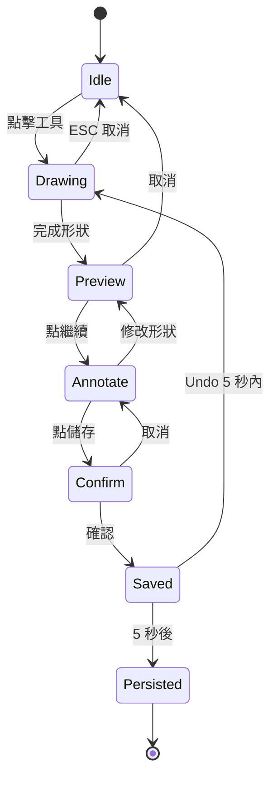
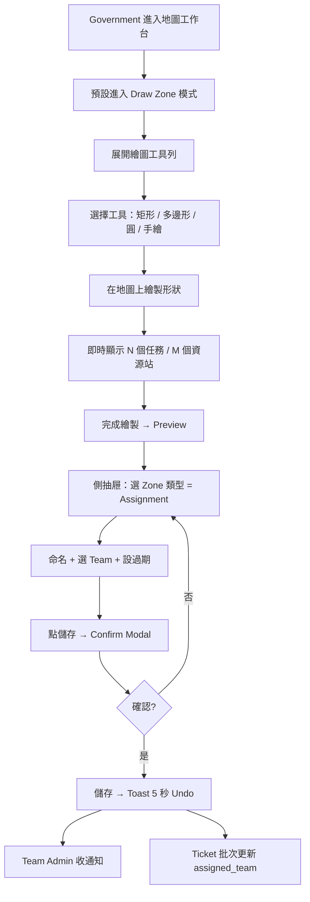
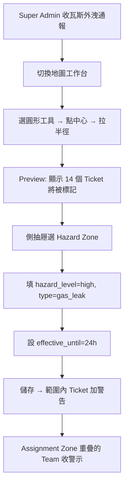
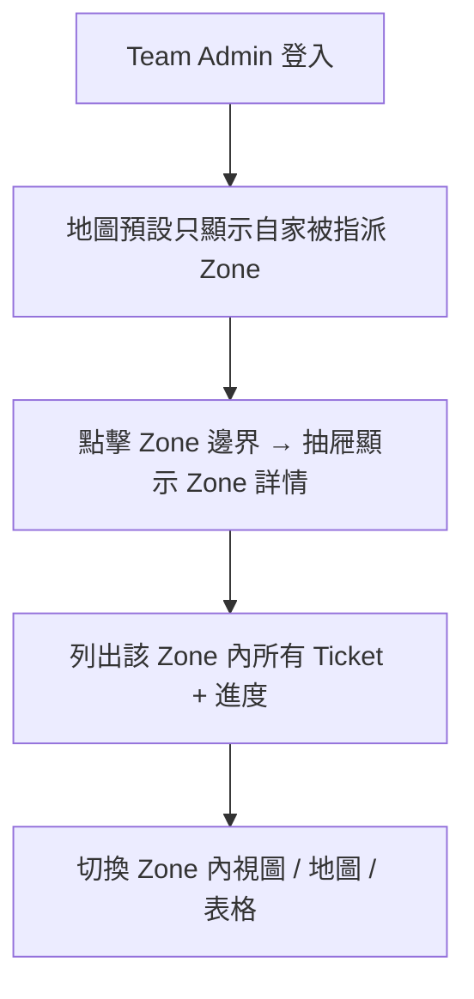

# Feature PRD — 即時決策輔助與地圖繪製 (Map Decision Support & Drawing)

> **版本：** v2.1 — 補地圖效能/聚合、繪製幾何正確性、離線策略研究與建議（不推翻 v2.0）
> **日期：** 2026-06-10
> **狀態：** Definition Phase
> **所屬功能：** 即時決策輔助 + 地圖繪製（ManagerEnd 核心模組）
> **關聯文件：** `research/map-performance-offline-geometry-patterns.md`、`research/competitive/patterns/map-drawing-ux-patterns.md`、`research/competitive/competitor-details/crisis-cleanup.md`、`research/competitive/competitor-details/arcgis-workforce.md`、`ai-context/decisions-log.md`、`product/user-journey.md`、`design/foundation/design-principles.md`、`UI-UX-Analysis.md`

> 🟡 **v2.1 補充（2026-06-10）**：v2.0 的繪圖工具、Zone 模型、狀態機、衝突規則完整，本次未推翻；補三個隱性缺口——**效能/聚合（≤500 markers 天花板太低）、繪製幾何正確性、離線/弱網**，並回填全部開放問題。研究依據見 [`research/map-performance-offline-geometry-patterns.md`](research/map-performance-offline-geometry-patterns.md)。

---

## 使用者情境

* **角色：** Super Admin、Government（主要繪製者）、Data Auditor、Team Admin / Member（檢視自家責任區）
* **場景：**
  * 災害發生時，Government 需要快速在地圖上「劃出 A 區交給慈濟、B 區交給壯闊台灣、C 區是危險禁區」，並讓對應 Team 立即看到自家區域內的所有任務。
  * 後台人員在山區或無門牌地區，需要透過電線桿編號定位。
  * 災害預警圖層（如土石流潛勢區、淹水警戒）需即時疊在地圖上輔助決策。
* **痛點 / 觸發點：**
  * 紙本劃區效率低、易誤分發；現場人員與後台脫節。
  * 沒有結構化的危險區標註 → 救援人員可能進入未知風險區。
  * 多個圖層資訊散落 → 需切換多個系統。

---

## IDEAL Case

### Path A — Government 劃區指派

1. Government 在地圖工作台點擊「✎ 繪圖工具」，工具列展開。
2. 選擇「矩形」工具，在花蓮市某行政區拉框。
3. 系統右下角即時顯示「框內有 47 個任務 / 3 個資源站」。
4. 在彈出的側抽屜選擇「指派類型 = Assignment Zone」、命名「A1 區」、選擇 Team「慈濟基金會」。
5. 點「確認指派」，二次確認對話框顯示「將 47 個任務指派給慈濟基金會？」。
6. 確認後地圖出現藍色透明區，5 秒內可點 Undo 撤回。
7. 慈濟的 Team Admin 立即收到通知「您已被指派 A1 區，47 個任務」。

### Path B — Super Admin 標註危險區

1. Super Admin 看到報告「中正路一段瓦斯外洩」，切換到地圖。
2. 點「圓形」工具，在中正路一段點中心，拖出半徑 200 公尺的圓。
3. 在側抽屜選擇「Hazard Zone」、嚴重程度「High」、寫上「瓦斯外洩，半徑 200m 禁止進入」。
4. 地圖出現紅色透明區，覆蓋範圍內所有現有 Ticket 自動加上「位於危險區」標籤。
5. 該區內若有 Team 已認領的 Zone，該 Team Admin 收到優先警示通知。

### Path C — 電線桿定位

1. 接到通報「壽豐鄉某電線桿附近受困」，後台人員在搜尋框輸入電線桿編號 `H2W-456`。
2. 地圖 3 秒內跳轉並標記該電線桿位置。
3. 後台人員直接在該位置建 Ticket，座標自動代入。

---

## User Story

### 地圖繪製
* As a **Government 成員**，I want **在地圖上以多種繪圖工具劃定區域並指派給 Team**，so that **能批次分配任務而不需逐一點選**。
* As a **Super Admin**，I want **標註危險區域並讓系統自動連動範圍內 Ticket**，so that **救援人員不會進入未知風險區**。
* As a **Team Admin**，I want **看到自家被指派的所有 Zone 邊界**，so that **能掌握責任範圍與資源分布**。

### 即時決策
* As a **後台應變人員**，I want **在地圖上用電線桿編號搜尋位置**，so that **能快速定位山區無門牌地區的事故點**。
* As a **後台應變人員**，I want **在同一個地圖頁面看到所有決策相關圖層**，so that **不需切換系統即可做決策**。
* As a **Government 成員**，I want **即時預覽繪製範圍內物件數量**，so that **避免不小心將過多任務丟給單一 Team**。

---

## 功能需求

### F1. 繪圖工具列（Floating Pill Toolbar）

#### F1.1 工具選項
| 工具 | 圖示 | 用途 | 可用角色 |
| --- | --- | --- | --- |
| **矩形** | ▢ | 快速框選大致範圍 | Super Admin, Government |
| **多邊形** | ⬠ | 精確邊界（最多 100 頂點） | Super Admin, Government |
| **圓形** | ◯ | 中心 + 半徑（適用爆炸 / 污染擴散） | Super Admin, Government |
| **手繪** | ✎ | 自由形狀（自然邊界） | Super Admin, Government |
| **單點 Pin** | ⊕ | 標危險點（不是區域） | Super Admin, Government |

#### F1.2 工具列行為
* 預設摺疊為單一 ✎ 按鈕，點開展開所有工具
* Mobile (< 768px) 改為底部抽屜
* 工具觸發時游標變十字，ESC / 右鍵取消

---

### F2. Zone（區域）資料模型

#### F2.1 兩種 Zone 類型

##### Assignment Zone（指派區域）
* **顏色**：藍色系，每 Team 自動分配獨立色票
* **屬性**：
  * name（必填）
  * geometry (polygon / circle / rectangle)
  * assigned_team_id
  * disaster_event_id（屬於哪場災害）
  * expires_at（可選，預設無）
  * created_by, created_at, updated_at
* **連動**：建立後系統列出範圍內所有 Ticket 並批次指派 `assigned_team_id`
* **可重疊**：允許，但同 Ticket 不可同時屬於兩個 Assignment Zone（最後指派覆蓋並警告）

##### Hazard Zone（危險區域）
* **顏色**：紅色系，依 hazard_level 漸層
* **屬性**：
  * name（必填）
  * geometry
  * hazard_level: `low` / `medium` / `high` / `critical`
  * hazard_type: `gas_leak` / `chemical` / `radiation` / `structural` / `flood_water` / `landslide_risk` / `fire_spread` / `other`
  * description
  * effective_until（可選，預設 24 小時自動失效）
  * created_by, created_at, updated_at
* **連動**：範圍內所有現有與未來 Ticket 自動加 `hazard_zone_ids[]` 並顯示警告圖示
* **可重疊**：允許，UI 取最高 hazard_level 顯示

> ⚠️ 待確認：是否要加更多 Zone 類型，如「避難集合點」「物資集散」？建議**否**，這些用 Pin / Resource Station 處理。

---

### F3. 繪製流程狀態機

#### 各狀態 UX 規範

| 狀態 | 表現 |
| --- | --- |
| **Idle** | 工具列摺疊，地圖為瀏覽模式 |
| **Drawing** | 游標十字，形狀邊框 dashed |
| **Preview** | 形狀填色 30% 透明，邊框 2px solid；**右下角浮動標籤顯示「N 個任務 / M 個資源站」** |
| **Annotate** | 側抽屜開啟，填寫名稱、類型、Team（若 Assignment）、描述 |
| **Confirm** | Modal「將 N 個任務指派給 Team T？」+ 確認 / 取消 |
| **Saved** | Toast「已建立 Zone」+ 倒數 5 秒 Undo 按鈕 |
| **Persisted** | 持久化進資料庫，所有訂閱者收到 push |

---

### F4. 即時預覽（範圍內物件計數）

* 繪製進行中即時 hit-test 範圍內：
  * Ticket 總數（依狀態分：待開始 / 進行中 / 完成）
  * Resource Station 總數
  * 已被其他 Team 認領的 Ticket 數（顯示衝突警示）
* 計數面板浮在地圖右下角，跟隨形狀邊界更新
* 若 > 100 物件，加紅色警示「⚠️ 任務數較多，請確認指派目標」

---

### F5. Undo / Conflict / 5 秒回復

* 儲存後 Toast 顯示「已建立 Zone X 並指派 N 個任務給 T」
* 倒數 5 秒，可點 **Undo** 完全撤回
* 若 5 秒內被其他人改動 → Undo 失效並提示
* Undo 動作寫入 Audit Log

---

### F6. 圖層管理（Layer Popover）

#### F6.1 預設圖層由上到下
1. 🚨 Active Ticket Markers
2. 🏢 Building Anchors (聚合的 Ticket 群)
3. 📍 Resource Station Markers
4. ⚠️ Hazard Zone Polygons
5. 🔷 Assignment Zone Polygons (依 Team 色票)
6. 🛣️ 電線桿編號 (CSV 點集)
7. 🌊 災害預警圖層 (外部資料整合)
8. 🗺️ OpenStreetMap 底圖

#### F6.2 每層控制
* 開 / 關
* 透明度 (0–100%)
* 圖例（Legend）
* 限定篩選（如 Assignment Zone 可只看「我家 Team」）

---

### F7. 電線桿編號圖層（沿用 v1.0）

* CSV 數據整合，每筆含 pole_id, lat, lng, area, voltage
* 搜尋框輸入 pole_id → 3 秒內地圖定位
* 點擊電線桿 Pin 可一鍵建 Ticket，座標代入

---

### F8. 災害預警圖層（沿用 v1.0）

* 整合 NCDR / 氣象局 / 內政部公開 API
* 顯示延遲 < 5 分鐘
* 圖層依災害類型有獨立色帶（地震輻、淹水區、土石流潛勢）

---

### F9. Zone 衝突規則

| 情境 | 規則 |
| --- | --- |
| 同類型 Zone 邊界重疊 | 允許，顯示「N 個重疊」標籤 |
| Hazard 覆蓋既有 Assignment Zone | 允許，Assignment Team Admin 收高優先警示 |
| 同 Ticket 同時落入兩個 Assignment Zone | **不允許**重複指派；最後建立的 Zone 覆蓋，並顯示衝突通知 |
| 同 Team 多個 Assignment Zone 重疊 | 允許，視為同一責任區 |
| 已過期 (`effective_until` 過了) Hazard Zone | 自動隱藏並標記 expired，不刪除 |

---

### F10. 編輯與刪除權限

| 動作 | Super Admin | Government | Team Admin | Data Auditor |
| --- | :---: | :---: | :---: | :---: |
| 建立 Assignment Zone | ✓ | ✓ | — | — |
| 編輯 Assignment Zone（建立者 + Super Admin）| ✓ | ✓（自建）| — | — |
| 刪除 Assignment Zone | ✓ | — | — | — |
| 建立 Hazard Zone | ✓ | ✓ | — | — |
| 編輯 / 刪除 Hazard Zone | ✓ | ✓（自建）| — | — |
| 變更 Zone 指派目標 Team | ✓ | ✓ | — | — |
| 查看自家被指派 Zone | ✓ | ✓ | ✓（自家）| ✓ |

---

## User Flow

### Flow 1 — Government 劃區指派

### Flow 2 — Super Admin 標記危險區

### Flow 3 — Team Admin 查看自家責任區

---

## 成功驗收標準

- [ ] Government 可用矩形 / 多邊形 / 圓 / 手繪 / Pin 五種工具在地圖上繪製形狀。
- [ ] 繪製進行中右下角即時顯示範圍內 Ticket 與 Resource Station 數量，更新延遲 < 100ms。
- [ ] 儲存 Zone 後 Toast 顯示 5 秒 Undo 按鈕，點擊可完全撤回。
- [ ] Assignment Zone 建立後 3 秒內，範圍內所有 Ticket 的 `assigned_team_id` 被批次更新，且該 Team Admin 收到通知。
- [ ] Hazard Zone 建立後，範圍內現有與未來 Ticket 自動加 `hazard_zone_ids[]`。
- [ ] Hazard Zone 預設 24 小時自動 expired，UI 隱藏但資料保留。
- [ ] 同 Ticket 被指派到兩個 Assignment Zone 時，後建立者覆蓋並顯示衝突警告。
- [ ] Team Admin 與 Team Member 進入地圖時，預設僅顯示自家責任 Zone（可手動切到全域）。
- [ ] 電線桿編號搜尋 3 秒內定位並標記。
- [ ] 多圖層同時開啟時，平移與縮放仍流暢（60 FPS for ≤ 500 markers）。
- [ ] Mobile (< 768px) 繪製工具改為底部抽屜，觸控頂點 ≥ 24px。

---

## 開放問題（待確認）

- [ ] **行政區 SHP 圖資**：是否要支援匯入既有行政區邊界？我建議 v2 再做。
- [ ] **沿線 Buffer 工具**：是否加入？目前不在 v1。
- [ ] **Hazard Zone 預設 24h 自動失效**：合理嗎？或應該由創建者指定？
- [ ] **跨 Team 協作 Zone**：是否支援一個 Zone 指派給多個 Team？建議**否**，避免責任不清。
- [ ] **Zone 編輯時 Ticket 重新計算**：若 Zone 邊界被移動，原範圍內 Ticket 應自動移除指派？或保留？建議**保留**，但提示 Government 確認。
- [ ] **Team Admin 是否能在自家責任區內畫子區**？建議 v2 再做。
- [ ] **Zone 名稱命名規範**：是否需要強制（如「A1 區」「花蓮市區 #1」）？目前自由命名。
  → 🟡 **建議**：自由命名但提供「行政區 + 流水號」預設樣板（如「花蓮市 #1」），降低混亂。

> 🟡 以下幾題的研究後建議，詳見 [`research/map-performance-offline-geometry-patterns.md`](research/map-performance-offline-geometry-patterns.md)：
> - **SHP 匯入** → 支持 v2；台灣行政區界圖資轉 GeoJSON 預載，劃區可「吸附」行政區界減少誤差。
> - **Buffer 工具** → Turf.js `buffer` 低成本，但 v1 非必要，列 v2。
> - **Hazard 24h 自動失效** → 建議「**預設 24h + 可自訂 + 到期前提醒延長**」，避免危險區默默消失（與 [[09-emergency-announcement]] 公告到期同語彙）。
> - **Zone 編輯後 Ticket 重算** → 支持保留；移出範圍的 Ticket 標「已不在 Zone 內」，由 Government 決定是否解除指派。

### 🆕 效能 / 幾何 / 離線（v2.1 新增開放問題）

- [ ] **效能天花板**：v2.0「≤500 markers 60fps」對災時上萬點偏低。是否升級為「採 **marker clustering + WebGL/vector tiles** 後，數千～上萬點仍流暢」？電線桿 CSV 預切 vector tiles？
- [ ] **聚合層次**：視覺 clustering 與 [[08-ticket-management]] 的語意 Building Anchor 群組化並存（兩者不同層次，可疊加）？
- [ ] **hit-test 效能**：即時計數（v2.0 <100ms）是否用 Turf.js + 空間索引（rbush），bbox 預篩再精算？座標統一 WGS84。
- [ ] **繪製正確性**：是否即時偵測多邊形自相交並提示？手繪是否做頂點簡化（Douglas–Peucker）避免上千頂點？
- [ ] **離線 / 弱網（v2.0 未涵蓋）**：v1 是否至少做到「**離線可讀已載入資料 + 降級提示（資料截至 HH:MM）+ 連線後重試送出**」？重點災區預載底圖磚？（與 [[07-resource-station]] 離線匯出呼應）

---

## 相關 Feature

* [[07-resource-station]] — 資源站地圖視圖
* [[08-ticket-management]] — 任務與 Zone 關聯、批次指派
* [[05-member-management]] — Zone 指派目標來自 Team 列表
* [[04-rbac]] — Zone 編輯權限

---

## 變更紀錄

| 版本 | 日期 | 更新重點 | 負責人 |
|------|------|----------|--------|
| v1.0 | 2026-05-28 | 初版建立，從 prd-manager-end.md §3.1 拆分 | — |
| v2.0 | 2026-05-28 | 加入地圖繪製功能（5 種工具）、Zone 資料模型（Assignment / Hazard）、繪製狀態機、即時預覽、Undo、圖層管理、衝突規則 | — |
| v2.1 | 2026-06-10 | 不推翻 v2.0；補效能/聚合（質疑 ≤500 markers 天花板、建議 clustering+WebGL+vector tiles）、繪製幾何正確性（自相交、hit-test 空間索引）、離線/弱網策略，並回填全部開放問題；新增研究檔 `research/map-performance-offline-geometry-patterns.md` | — |
