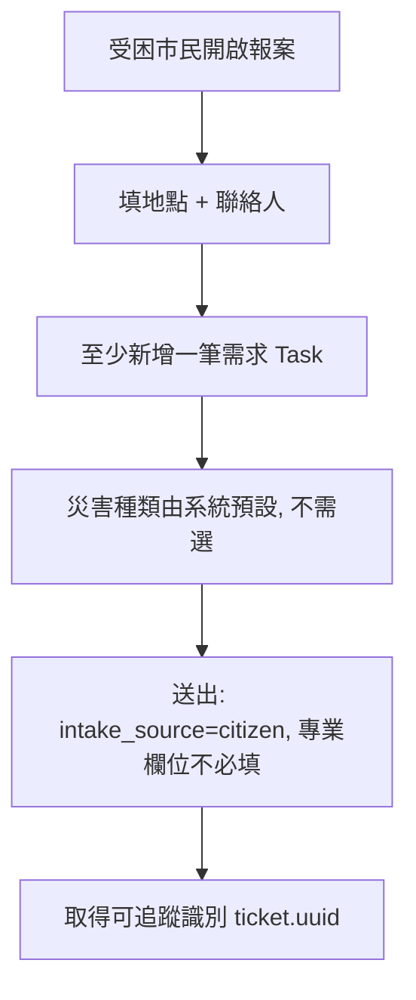
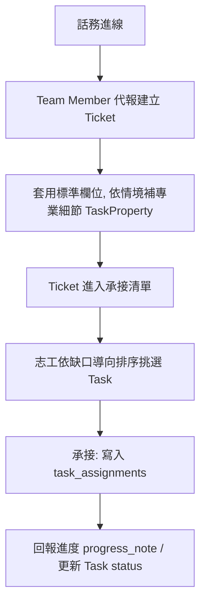

# Feature PRD — 任務管理 (Ticket Management)

> **狀態：** Definition Phase
> **北極星（問題空間）：** [`user-stories.md`](user-stories.md)
> **相關 Feature：** [[04-rbac]]（權限）、[[05-member-management]]（Team／志工身份）、[[06-map-decision-support]]（地圖、劃區指派）、[[07-resource-station]]（資源站協作）、[[10-guest-ticket-privacy]]（訪客端可見性）

本文件描述「任務管理」的資料模型與功能規格。已與後端實際 schema（`Backend/Spec/Docs/er-diagram.md`）對齊：凡標為「規格」者已有 schema 支撐或已拍板；凡列於文末「待拍板」者為尚未定案、將於設計討論中收斂的項目，**不應視為已定規格實作**。

---

## 核心模型：四層結構

任務資料由四個層次組成，由地理底層逐層向下展開。理解這四層是讀懂本文件的前提。

```
base_geometries（地理底層：經緯度、建立者）
  └─ Ticket（地點錨點）        一個出事的地址：地址、聯絡人、整體狀態
       └─ Task（需求）          掛在 Ticket 下的一筆筆具體需求，一對多
            ├─ TaskProperty     需求的型別專屬細節（鍵值，彈性欄位）
            └─ TaskAssignment   誰承接了這筆需求（接案者、承接時間）
```

四層各自的職責：

| 層 | 是什麼 | 一句話 |
|---|---|---|
| **Ticket** | 地點錨點 | 「哪裡出事了」——地址、經緯度、現場聯絡、整體處理狀態 |
| **Task** | 需求 | 「這裡要什麼」——破拆人力、圓鍬、礦泉水、有人受困…一個 Ticket 可有多筆 |
| **TaskProperty** | 需求細節 | 需求的彈性補充欄位（鍵值），承載災害／型別專屬情報 |
| **TaskAssignment** | 承接關係 | 「誰在處理這筆需求」——承接、多人協作都在這層 |

四個貫穿全文的原則：

1. **報案不卡關**：第一線求救走精簡路徑，專業欄位一律可選、可後補，不用必填星號把求救者擋在門外。
2. **地點與需求分離**：Ticket 管「在哪」、Task 管「要什麼」；**指派與承接一律以 Task 為單位**，志工承接的是「需求」而非整個地點。
3. **一套骨架承載所有災種**：災害差異透過欄位與彈性 TaskProperty 表現，不為每種災害另造一張表。
4. **必填依來源分流**：民眾自助報案極簡、後台代報標準、外部匯入依映射（見 F1）。

---

## 災害事件（平台情境）

災害種類**不是 Ticket 的欄位**，而是「當前這場應變」的情境，掛在**平台層**。

* **平台一次只處理一場應變。** 平台維護一個「當前災害事件」：事件名稱、災害種類集合、影響行政區、起訖時間。
* **災害種類是集合，可複合、可增減。** 例如「地震」後續引發「火災」，是在事件層**加開**火災（種類集合變為 `[地震, 火災]`），而非逐張 Ticket 貼標籤。
* **所有 Ticket 隸屬當前事件，不各自攜帶災害種類。** 報案者因此**不需選擇災害**——系統以當前事件預設。
* **範圍是湧現、不是欄位。** 「單棟樓」還是「整個行政區」，由 Ticket 在地圖上的分佈自然看出，不需宣告。
* **「這個點在發生什麼」由 Task 表達，不由災害種類。** 失火的樓產生「破拆」需求、淹水的樓產生「清淤」需求；細節寫進 TaskProperty。災害種類只負責大局脈絡、統計維度、報案預設。

> **取捨（有意識選擇）：** 因災害種類在平台層，系統**無法用它指名「某棟樓是火災」**——那種資訊改由該地點掛了哪些 Task 表達。

---

## 使用者情境

同一套 Ticket→Task 模型承載所有災種，差別只在需求種類與「是否需要後補專業情報」。

* **地震・有人受困**：花蓮地震，仁愛路 100 號透天厝半倒。報案只填「地點＋需求（破拆人力、圓鍬、有人受困）」；結構穩定度、受困樓層等由後台指揮事後補齊。
* **水災・清淤需求**：仁愛路積水，需要清淤人力與圓鍬。純人力＋物資需求，沒有任何結構欄位，報案表單極短。
* **火災・高樓延燒**：大樓 5F 起火向上延燒，需破拆與確認危害物質；後台補結構／危害資訊。
* **颱風・路樹倒塌停電**：需交通排除與通訊／電力支援；需求會連動到 [[07-resource-station]] 的發電／通訊站。
* **純物資需求**：避難所礦泉水見底，開一筆「物資-礦泉水 ×200」需求，無關建築。

**共同痛點：**

* 求救當下若用一長串專業必填欄位，會把驚慌中的市民擋在門外。
* 不同災害需要的資訊差很多，硬塞同一張長表會讓現場填寫崩潰。
* 一個地點往往有多種需求（人力＋物資＋搜救），混在一筆任務裡無法分別指派與媒合。
* 同地址多筆報案若不整理，地圖會被重疊標點淹沒。

---

## 角色

| 角色 | 在本特性中的立場 |
|------|------------------|
| 一般使用者 / 受困市民 | 前台自助報案（`citizen_report`）：只填得出最基本的地點與需求 |
| 志工（接案者 actor） | 在承接清單挑選 Task 承接、回報進度；身份模型對齊 [[05-member-management]] |
| Team Member | 後台代報（`staff_intake`，含電話進線）、處理自家被指派的任務 |
| Team Admin | 管理自家責任區的 Ticket／Task |
| Government | 劃區批次指派任務給 Team；不看 Team 內部名單 |
| Super Admin | 全域治理：最高優先級覆寫、刪除任務 |
| Data Auditor | 審查 AI 建議：疑似重複任務比對、審核狀態流轉 |

---

## 資料模型

> 欄位標示：**規格** = 已有 schema 支撐；**🆕 提案** = 功能需要但 schema 尚無，是否納入見「待拍板」。

### L1 — Ticket（地點錨點）

| 欄位 | key | 必填 | 說明 |
|---|---|:---:|---|
| 任務編碼 | `uuid` | ✓ | PK，同時 FK 至 `base_geometries`；前端不顯示、自動帶入 |
| 經緯度 | `base_geometries.geometry` | ✓ | 繼承自地理底層 |
| 地址 | `secondary_locations`（county/city/lane/alley/no/**floor**/room） | ✓ | 可拆解至樓層；`floor` 供高樓救援情境使用 |
| 標題 | `title` | ✓ | |
| 說明 | `description` | — | 自由文字；對訪客不給原文（見 [[10-guest-ticket-privacy]]） |
| 現場聯絡人 | `contact_name` | ✓ | 對訪客遮罩 |
| 聯絡 Email | `contact_email` | — | 對訪客遮罩 |
| 聯絡電話 | `contact_phone` | — | 對訪客遮罩 |
| 整體狀態 | `status` | ✓ | `pending / in_progress / completed / canceled / archived`（地點層狀態） |
| 優先級 | `priority` | ✓ | `low / medium / high / critical`（見 F3） |
| 情境分類 | `task_type` | ✓ | `search_rescue / medical_support / fire_response / supply_delivery / …` |
| 可見性 | `visibility` | ✓ | `public / restricted / internal`（見 F4） |
| 審核狀態 | `verification_status` | ✓ | `unverified / ai_verified / human_verified / disputed` |
| 審核註記 | `review_note` | — | 內部資料，不對訪客 |
| 現場照片 | `photos`（`ref_type=ticket`） | — | 多筆 |
| 建立者 | `base_geometries.created_by` | ✓ | 自動帶入 |
| 🆕 報案來源 | `intake_source` | ✓ | `citizen / staff / system`；驅動必填分流（F1），是否新增見「待拍板 A」 |

> **狀態語義釐清：** Ticket 只有一個 `status`（地點層），與 Task 的 `status`（需求層）是**兩個不同層次各一個**，並非重複。地點層看「這個地址整體處理到哪」，需求層看「單一需求辦好了沒」。

### L2 — Task（需求，`ticket_tasks`）

| 欄位 | key | 說明 |
|---|---|---|
| 需求種類 | `task_type` | `hr / supply / rescue` |
| 需求名稱 | `task_name` | 如「破拆人力」「圓鍬」「礦泉水」 |
| 需求說明 | `task_description` | 可選 |
| 數量 | `quantity` | 可選（物資／人力數） |
| 需求狀態 | `status` | `pending / in_progress / fulfilled / canceled` |
| 來源 | `source` | `user / gov / crawler / ngo / admin` |
| 進度註記 | `progress_note` | 現場回報 |
| 重複偵測 | `is_duplicate` / `dedup_group_id` / `confidence_score` | AI 標記，見 F5 |
| 審核狀態 | `moderation_status` | `pending_review / approved / rejected / merged` |
| 可見性 | `visibility` | `public / restricted / internal` |
| 路線 | `route_uuid` | 可選，關聯 `routes`（如物資運送路線） |
| 建立／時間 | `created_by` / `created_at` / `updated_at` | |

### L3 — TaskProperty（需求細節，`task_properties`）

彈性鍵值表：`property_name` / `property_value` / `quantity?` / `status?` / `comment?`。

**用途：承載型別專屬與災害專屬情報**（如物資品項清單、結構穩定度、受困人數、危害物質…）。**已定調走鍵值（EAV）而非為每種災害新增固定欄位**，換來「一套骨架承載所有災種」的彈性；代價是這些值不進結構化 BI、也不能天然驅動必填邏輯（直立救援若需條件必填如何在 EAV 上落地，見「待拍板 B」）。

### L4 — TaskAssignment（承接關係，`task_assignments`）

`actor_uuid`（接案者）/ `role?` / `assigned_at`。**承接以 Task 為單位**，同一筆需求可有多筆承接（多人協作）。志工接案、後台指派都落在這層。

---

## 功能需求

### F1. 報案與誕生來源（必填分流）

Ticket 有三種誕生來源，必填規則依來源分流，確保「報案不卡關」：

| 來源 | key | 必填強度 |
|---|---|---|
| 前台民眾自助報案 | `citizen` | **極簡**：只要地點＋至少一筆需求＋聯絡人；專業欄位一律不必填 |
| 後台代報（含話務進線） | `staff` | **標準**：套用較完整欄位；專業欄位可依情境轉必填 |
| 外部系統匯入／轉派 | `system` | **依映射**：由來源資料決定 |

* 前台報案者**不需選擇災害種類**——由系統預設（無後台環境時預設單一災害）。
* 報案成功後給報案者一個可追蹤識別（`ticket.uuid`），供日後查詢進度。

### F2. 需求與承接

* **承接模型**：志工自我承接 Task（寫入 `task_assignments`）。
* **缺口導向排序**：承接清單依「缺口大 / 優先級高 / 距離近」排序，引導人力流向冷區、避免扎堆。
* **承接上限**：單一志工承接數設上限（可設定），防扎堆。
* 一筆需求可多人承接（`task_assignments` 一對多）。
* 技能媒合、地理自動媒合列入後續版本。
* **志工身份模型**（承接者是「前台一般使用者」還是登錄的 Team Member）需與 [[05-member-management]] 對齊，見「待拍板 F」。

### F3. 優先級

四級優先級（`priority`）：

| 優先級 | key | 意義 |
|---|---|---|
| 生命危急 | `critical` | 最高 |
| 高 | `high` | |
| 中 | `medium` | 一般 |
| 低 | `low` | |

* **立刻救援（手動最高覆寫）**：限 Super Admin，一鍵將 Ticket 升至 `critical`，前台與後台同步推送，需二次確認。
* SLA（承接時限）與逾時自動升級警示屬進階治理機制，是否於本版納入見「待拍板 C」。

### F4. 可見性與訪客隱私

* Ticket 與 Task 皆有 `visibility`（`public / restricted / internal`），為訪客端存取控制與欄位揭露分級的基礎。
* `restricted / internal` 的資料不應出現在未登入者的查詢結果；`public` 資料對訪客採「最小揭露」（降精度座標、自由文字不給原文、聯絡欄位遮罩）。
* 完整規格見 [[10-guest-ticket-privacy]]。

### F5. 疑似重複偵測與審核

* Task 具備 `is_duplicate` / `dedup_group_id` / `confidence_score`：AI 自動標記疑似重複需求。
* Data Auditor 並排對比，操作反映於 `moderation_status`：`approved`（保留）/ `rejected` / `merged`（合併）。
* **重複偵測（合併同一件事）** 與「同建築多筆 Ticket 的群組化顯示」是不同概念；後者是否納入見「待拍板 D」。

### F6. 表格與統計

* **任務統計**：任務總量、依狀態／情境分類／Team／行政區交叉統計。
* **志工統計**：每日承接人數、累計承接數；志工缺口比例（真實人數 / 需求量），缺口 > 50% 紅色警示（閾值可設定）。
* **任務變更歷史**：限 Admin / Auditor / Government 檢視。

### F7. 地圖視圖與劃區指派

* 與 [[06-map-decision-support]] 共用底圖，Ticket 依 `geometry` 呈現於地圖。
* Government 在地圖拉框，將範圍內 Ticket 批次指派給某 Team。
* 整個 Ticket（含其所有 Task）屬於同一 Team，避免責任不清。

### F8. 編輯動作權限總表

> 權威定義見 [[04-rbac]]；此處為本特性的操作對應。

| 操作 | Super Admin | Government | Team Admin | Team Member | Auditor | 志工 |
|---|:---:|:---:|:---:|:---:|:---:|:---:|
| 前台自助報案 | — | — | — | — | — | ✓ |
| 後台代報建立 Ticket | ✓ | ✓（自區） | ✓（自家） | ✓（自家） | — | — |
| 修改 Ticket／Task 欄位 | ✓ | ✓（自區） | ✓（自家） | ✓（自家被指派） | ✓ | — |
| 變更狀態 | ✓ | ✓（自區） | ✓（自家） | ✓（自家被指派） | ✓ | ✓（自己承接的 Task） |
| 承接 Task | — | — | — | ✓ | — | ✓ |
| 刪除任務 | ✓ | — | — | — | — | — |
| 立刻救援（最高優先級覆寫） | ✓ | — | — | — | — | — |
| 批次劃區指派 | ✓ | ✓ | — | — | — | — |
| 審核 / 重複偵測處理 | ✓ | — | — | — | ✓ | — |

---

## User Flow

### Flow 1 — 前台精簡報案



### Flow 2 — 後台代報 + 承接



---

## 成功驗收標準

* [ ] 一筆 Ticket 可掛多筆 Task；承接與指派以 Task 為單位（寫入 `task_assignments`）。
* [ ] 前台自助報案走精簡表單，無專業必填欄位即可送出，並取得可追蹤識別。
* [ ] 後台代報套用標準欄位，可透過 TaskProperty 補齊型別／專業細節。
* [ ] Ticket 與 Task 各有獨立 `status`，語義不混淆。
* [ ] 承接清單依「缺口大 / 優先級高 / 距離近」排序；單一志工承接數受上限限制。
* [ ] 四級優先級可用；「立刻救援」限 Super Admin 且需二次確認。
* [ ] `visibility` 三級可標記，`restricted / internal` 不出現在訪客查詢結果（細節見 [[10-guest-ticket-privacy]]）。
* [ ] AI 標記疑似重複 Task，Auditor 可完成保留 / 拒絕 / 合併，反映於 `moderation_status`。
* [ ] Government 拉框批次指派可更新範圍內 Ticket 的所屬 Team。
* [ ] 志工缺口比例即時顯示，超過閾值紅色警示。
* [ ] 刪除任務僅 Super Admin 且需二次確認。

---

## 待拍板（設計決策）

模型方向已定：**四層 Ticket→Task 結構、災害在平台層、災害專屬情報走 EAV**；設計原型將據此重做。以下為此方向下仍待收斂者，定案前不應視為規格。

**A. 報案來源欄位 `intake_source`。** 「必填依來源分流」(F1) 需要一個來源標記，但 schema 尚無 ticket 層來源欄位（現有 `source` 在 Task 層、語義不同）。要決定是否新增 `ticket.intake_source(citizen/staff/system)`，或以其他方式推導。

**B. 直立救援（高樓／結構救援模式）。** 舊設計有一套「三閘門條件式必填」機制（樓層≠1F、主動勾選、建築繼承 → 專業欄位轉必填）。在 EAV 模型下，對鍵值欄位做「條件式必填」技術上更難。要決定：此機制是否保留？若保留，觸發條件與必填如何在四層 + EAV 上落地？

**C. SLA 與逾時升級。** 四級優先級已有，但 schema **沒有** SLA 時限、逾時升級相關欄位。要決定 v1 是否納入「生命危急逾時未承接自動升級警示」，或列入後續版本。

**D. 同建築群組化（Building Anchor）。** 同地址多樓層多筆 Ticket 合併為建築錨點顯示的機制，schema **完全沒有**對應資料表（Task 層的 dedup 是「合併同一件事」，與此不同）。要決定是否納入；納入即需新增資料表與關聯。

**E. 兩個 `task_type` 的分工。** Ticket 層有 `task_type(search_rescue/medical_support/…)`、Task 層也有 `task_type(hr/supply/rescue)`，語義重疊。要釐清何者為「情境分類」、何者為「需求種類」，避免混淆。

**F. 志工身份模型。** 承接 Task 的志工是「前台一般使用者」還是需登錄的 Team Member？影響承接權限與資料邊界，需與 [[05-member-management]] 對齊。
