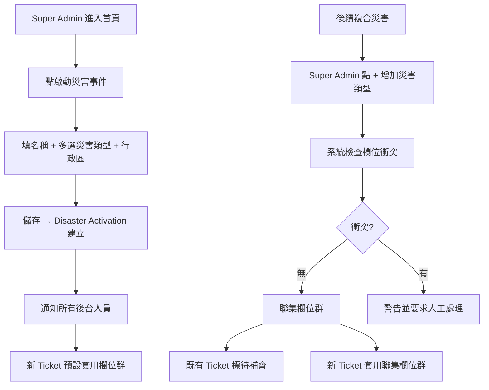
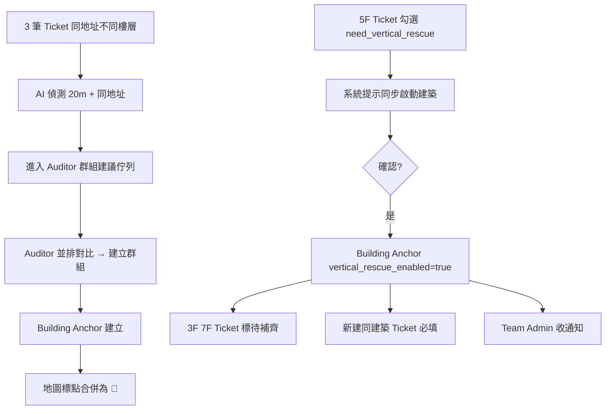
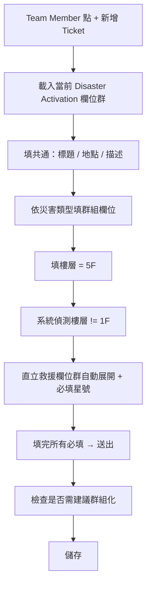

# Feature PRD — 任務管理 (Ticket Management)

> **版本：** v2.1 — 補優先級/SLA/升級、志工媒合、USAR 欄位精簡研究與建議（不推翻 v2.0）
> **日期：** 2026-06-10
> **狀態：** Definition Phase
> **所屬功能：** 任務管理 Ticket Management（ManagerEnd 核心模組）
> **關聯文件：**
> * `research/priority-sla-volunteer-matching-patterns.md`
> * `research/competitive/patterns/dynamic-form-patterns.md`
> * `research/competitive/patterns/vertical-rescue-usar.md`
> * `research/competitive/patterns/incident-grouping-patterns.md`
> * `research/competitive/competitor-details/crisis-cleanup.md`
> * `research/competitive/competitor-details/sahana-eden.md`
> * `ai-context/decisions-log.md`、`product/user-journey.md`、`design/foundation/design-principles.md`、`UI-UX-Analysis.md`

> 🟡 **v2.1 補充（2026-06-10）**：v2.0 的災害欄位群組、直立救援三層、Building Anchor 群組化非常完整，本次未推翻；補三個較弱面向——**優先級/SLA/逾時升級（v2.0 僅二元）、志工媒合模型（v2.0 僅缺口統計）、USAR 15 欄精簡（v2.0 自己提的開放問題）**，並回填全部開放問題。研究依據見 [`research/priority-sla-volunteer-matching-patterns.md`](research/priority-sla-volunteer-matching-patterns.md)。

---

## 使用者情境

* **角色：** Super Admin（完整操作）、Government（劃區指派）、Team Admin / Team Member（建立 / 編輯自家責任區 Ticket）、Data Auditor（審查與群組化確認）
* **場景：**
  * **場景 A — 大規模災害事件啟動**：花蓮發生 7.0 地震，Super Admin 開啟「地震」災害類型，系統建立 Disaster Activation，所有新 Ticket 預設帶入地震欄位群。
  * **場景 B — 複合災害**：原本水災已啟動，後續釀成火災，Super Admin 點「+ 增加災害類型 = 火災」，火災欄位群**聯集**加入既有水災欄位群，新 Ticket 表單同時顯示兩組欄位。
  * **場景 C — 同建築多 Ticket**：某高樓火災，3F、5F、7F 各自有人員報案，產生 3 筆 Ticket。AI 偵測到同地址，建議建立 Building Anchor，Data Auditor 確認後地圖上 3 個標點合併為一個建築錨點。
  * **場景 D — 直立救援啟動**：5F 那筆 Ticket 經評估需直立救援，Admin 在建築錨點上點「啟動直立救援」，3F 與 7F 也自動套用直立救援必填，後續新建同建築 Ticket 也必填。
  * **場景 E — Government 批次指派**：Government 框選某行政區，將 47 筆 Ticket 整批指派給慈濟基金會。
* **痛點 / 觸發點：**
  * 不同災害需要不同資訊，硬把所有欄位塞在同一張表會讓現場填寫崩潰。
  * 直立救援若全平台強制必填，會干擾平地求救案件；若不強制，又會漏資訊。
  * 同建築多樓層的 Ticket 不群組化，地圖會被重疊標點淹沒。

---

## IDEAL Case

### Path A — 災害類型 onboarding

1. Super Admin 在首頁點「啟動災害事件」。
2. 選擇災害類型（地震）+ 行政區（花蓮縣）+ 起始時間。
3. 系統建立 Disaster Activation，並通知所有後台人員「地震模式已啟動」。
4. 之後所有新建 Ticket 表單自動帶出**共通欄位 + 地震欄位群**。

### Path B — 複合災害切換

1. 水災啟動中，地震又發生。
2. Super Admin 點「+ 增加災害類型 = 地震」。
3. 系統檢查欄位衝突，無誤後聯集兩組欄位。
4. 通知後台「水災 + 地震 複合模式已啟動」。
5. 既有 Ticket 不強制重新填寫，但表單顯示「地震欄位待補齊（可選）」。

### Path C — 同建築 Ticket 群組化

1. 某高樓地震受困，3F、5F、7F 各有 Ticket 提交。
2. AI 偵測到 20 公尺內 3 筆 Ticket 且地址主部相同，列入「群組建議佇列」。
3. Data Auditor 看到並排對比，確認後點「建立群組」。
4. 系統建 Building Anchor「中山路 100 號」，3 筆 Ticket 加上 `building_anchor_id`。
5. 地圖上原 3 個標點合併為 🏢 建築圖示，點開展開樓層樹。

### Path D — 直立救援觸發

1. 5F 受困者經評估需垂直救援。
2. Team Member 在該 Ticket 勾選 `need_vertical_rescue=true`。
3. 系統提示「將同步啟動建築 X 的直立救援模式？」。
4. 確認後 Building Anchor `vertical_rescue_enabled=true`，3F 與 7F Ticket 自動標「待補齊欄位」。
5. Team Admin 收到通知，指派成員補齊欄位。
6. 之後在該建築新建的 Ticket 表單，直立救援欄位群自動必填。

### Path E — Government 批次指派

1. Government 在地圖切到 Draw Zone 模式。
2. 拉框某行政區，預覽顯示「47 個任務」。
3. 選 Team「慈濟」確認指派。
4. 47 個 Ticket 的 `assigned_team_id` 批次更新，慈濟 Team Admin 收通知。

---

## User Story

### 災害類型欄位群組
* As a **Super Admin**，I want **啟動災害事件並選擇災害類型**，so that **新建 Ticket 自動套用對應欄位群，現場人員不用每次選**。
* As a **Super Admin**，I want **複合災害發生時增加災害類型，欄位群聯集疊加**，so that **不會遺漏任何災害的關鍵資訊**。
* As a **Team Member**，I want **在新建 Ticket 時看到分組顯示的欄位（共通 / 水災 / 火災）**，so that **能聚焦填寫不混亂**。

### 直立救援
* As a **Team Member**，I want **填樓層 ≥ 2F 時自動觸發直立救援必填**，so that **不會忘記填關鍵的結構評估欄位**。
* As a **Super Admin / Government / Team Admin**，I want **對某建築一鍵啟動直立救援，連動所有同建築 Ticket**，so that **所有負責成員都知道此建築進入垂直救援模式**。
* As a **Team Member（一樓求救任務）**，I want **不要被直立救援必填卡住**，so that **平地任務不受高樓救援欄位干擾**。

### Ticket 群組化
* As a **Data Auditor**，I want **看到 AI 建議的群組候選並一鍵確認**，so that **快速整理地圖上的重疊標點**。
* As a **Team Admin**，I want **在地圖上看到聚合的建築錨點而不是 10 個重疊標點**，so that **能清楚掌握同建築多任務的全貌**。

### 任務管理（沿用 v1.0）
* As a **Government 成員**，I want **拉框批次指派任務**，so that **節省逐筆操作時間**。
* As a **Data Auditor**，I want **並排對比 AI 標記的疑似重複任務**，so that **快速合併或拒絕**。
* As a **Super Admin**，I want **看到志工缺口比例與警示**，so that **能主動調度資源**。
* As a **Super Admin**，I want **對極高優先任務一鍵啟動「立刻救援」**，so that **立即提升優先級**。

---

## 功能需求

### F1. 災害類型欄位群組（核心新增）

#### F1.1 災害類型定義（由系統預先定義，不可動態建立）

| 災害類型 | Backend key | 預設欄位群組 |
| --- | --- | --- |
| 地震 | earthquake | 共通 + 結構評估 + (直立救援可選) |
| 火災 | fire | 共通 + 火勢狀態 + (直立救援可選) |
| 水災 | flood | 共通 + 水位 + 清淤 |
| 颱風 | typhoon | 共通 + 風災 + 清淤 |
| 土石流 | landslide | 共通 + 結構評估 + 清淤 + (直立救援可選) |
| 海嘯 | tsunami | 共通 + 結構評估 + 水位 |
| 輻射 | radiation | 共通 + 危害物質 |
| 戰爭 | war | 共通 + 結構評估 + (直立救援可選) + 危害物質 |
| 流行病 | epidemic | 共通 + 醫療專屬 |
| 其他 | other | 共通 |

> ⚠️ 待確認：是否要追加「化學災害」「核災」「人為事故」？目前合在 other / radiation。

#### F1.2 欄位群組（FieldGroup）

```yaml
field_groups:
  common:        # 全 Ticket 必含
    fields: [task_id, task_type, title, description, status, priority, location, source, ...]

  earthquake:
    fields: [collapse_level, structure_type, structure_stability]

  fire:
    fields: [fire_status, gas_leak, fire_spread_risk]

  flood:
    fields: [water_level, contamination, pump_needed]

  cleanup:
    fields: [cleanup_type, required_tools]

  vertical_rescue:  # 特殊群組，由條件觸發
    fields: [collapse_level, structure_stability, hazmat_status, entry_point,
             victims_known_count, victims_confirmed_alive, victims_by_floor,
             communication_status, estimated_trapped_hours, required_equipment,
             usar_level, estimated_operation_hours, requires_field_commander]

  medical:
    fields: [injury_severity, medical_capability_needed]

  hazmat:
    fields: [hazmat_type, hazmat_amount, evacuation_radius]
```

#### F1.3 聯集規則（多災害類型啟動）

| 衝突情境 | 處理 |
| --- | --- |
| 同 key 不同 label | 取先啟動災害類型的 label，後加入者 label 進 tooltip 別名 |
| 同 key 不同 type | **錯誤**，建置時攔截，禁止此類定義 |
| 同 key 不同選項 | **聯集**選項，並標 `(僅 X 災)` |
| 同 key 不同必填要求 | **最嚴格**（任一要求 → 必填） |

#### F1.4 表單呈現（Accordion）

* 共通欄位永遠在最上方且預設展開
* 各災害類型欄位群以 Accordion 分組，預設展開「主要災害類型」，其他摺疊
* 摺疊狀態顯示「✕ 個欄位待填」標籤
* 欄位左側細色條標示來源災害類型（地震=橙、水災=藍、火災=紅）

#### F1.5 災害類型 chip 切換

* 表單頂部顯示已啟動災害類型 chips：`[地震] [水災] [+]`
* 點 chip 旁 `×` 移除該災害類型，**已填資料保留但灰化**
* 不可移除最後一個災害類型

---

### F2. Disaster Activation（事件啟動）

#### F2.1 啟動流程
* Super Admin / Government 點「啟動災害事件」
* 填寫：
  * 事件名稱（如「2026 花蓮 7.0 地震」）
  * 災害類型（多選）
  * 影響行政區（多選縣市 / 鄉鎮市區）
  * 起始時間
  * 預期持續時間（可選）
* 啟動後所有後台人員收通知

#### F2.2 複合災害切換
* 在現有事件上點「+ 增加災害類型」
* 系統檢查欄位衝突，無誤後聯集
* 通知後台 + 既有 Ticket 標記「新欄位待補齊（可選）」

#### F2.3 關閉事件
* Super Admin 可關閉，需附理由與結束時間
* 關閉後 Ticket 仍可瀏覽但不可新建

---

### F3. 直立救援三層觸發（核心新增）

> 詳見 `research/competitive/patterns/vertical-rescue-usar.md`

#### F3.1 Layer 1 — 災害層（顯示）
* 啟動的災害類型包含 `earthquake / fire / landslide / war` 任一 → 表單**顯示**直立救援欄位群（預設摺疊、可選）

#### F3.2 Layer 2 — Ticket 層（自動必填）
* 任一條件達成 → 該 Ticket 直立救援欄位變必填：
  * `floor_level` 不為 `1F` 且非空
  * `need_vertical_rescue=true`（使用者主動勾選）
  * `victims_known_count >= 1` 且 `floor_level != '1F'`
  * `structure_stability` 任一值已填寫
* UI：欄位旁 ⚠️ 橘色三角形 + tooltip「因為 X 條件，此欄位變為必填」

#### F3.3 Layer 3 — 建築層（繼承）
* 若 Ticket 屬於 Building Anchor 且 `building_anchor.vertical_rescue_enabled=true`：
  * 該建築下**所有新建 Ticket** 自動套用必填
  * 既有 Ticket 顯示橘色 Banner「直立救援已啟動，請補齊欄位」
  * Team Admin 收通知

#### F3.4 啟動 / 解除
* **啟動**：任一 Ticket 觸發 Layer 2 條件 → 提示「同步啟動建築 X 的直立救援？」→ 確認後 `vertical_rescue_enabled=true`
* **手動啟動**：Admin 在 Building Anchor 抽屜點「啟動直立救援」
* **解除**：**僅 Super Admin**，附理由；解除後欄位資料保留但不再必填

---

### F4. Ticket 群組化（Building Anchor）

> 詳見 `research/competitive/patterns/incident-grouping-patterns.md`

#### F4.1 AI 偵測
* 條件：
  * 兩筆以上 Ticket 在 **20 公尺半徑內**
  * 地址主要部分相同（同街、同號）
  * 任一 Ticket `floor_level` 非 `1F` 或非空
* 結果進入 Data Auditor 的「群組建議佇列」

> ⚠️ 待確認：20 公尺對台灣街區是否合適？大型廠房可能需要更大。建議**設為可調參數，預設 20m**。

#### F4.2 Data Auditor 確認
* 並排對比 UI 顯示候選 Ticket 列表
* 操作：
  * **建立群組** → 建立 Building Anchor 並關聯所有候選 Ticket
  * **拒絕建議** → 標記 candidate 已審且不成立，不再提示
  * **部分建立** → 勾選部分 Ticket 建立群組

#### F4.3 Building Anchor 資料模型
```yaml
BuildingAnchor:
  id: uuid
  display_name: string
  primary_address: string
  coordinate: { lat, lng }
  floor_count: integer?
  vertical_rescue_enabled: boolean
  vertical_rescue_activated_at: timestamp?
  vertical_rescue_activated_by: user_id?
  ticket_count: integer (cached)
  status_summary: { pending, in_progress, completed } (cached)
  assigned_team_id: uuid? (若所屬 Zone 已被指派)
  created_at, updated_at
```

#### F4.4 地圖呈現
* 已群組化 → 顯示 🏢 建築圖示 + 標籤「中山路 100 號 (5)」
* 點擊展開抽屜，按樓層樹排序列出所有 Ticket
* 若 `vertical_rescue_enabled=true` → 圖示加紅色邊框與⚠️標記

#### F4.5 手動加入 / 移除
* Admin / Auditor 可手動將 Ticket 加入 / 移出 Building Anchor
* 移除最後一筆 Ticket 不會自動刪除 Anchor，由 Admin 決定

---

### F5. Table + BI 表格與統計（沿用 v1.0）

#### F5.1 任務統計
* 任務總量 + 依進度篩選
* 依災害類型 / Team / Zone / 行政區交叉統計

#### F5.2 志工統計
* 每日媒合人數、累計承接數
* **志工缺口**：真實人數 / 需求量（如 300 / 3000 = 10%）
* 缺口 > 50% 紅色警示（閾值可設定）

#### F5.3 任務變更歷史
* 限 Admin / Auditor / Government 檢視

---

### F6. 地圖視圖與劃區指派（沿用 v1.0 + 連動 F4）

* 與 [[06-map-decision-support]] 共用底圖
* Government 拉框批次指派 → Ticket 的 `assigned_team_id` 批次更新
* 若範圍內有 Building Anchor → 該 Anchor 的 `assigned_team_id` 也更新

---

### F7. AI 疑似重複任務比對（沿用 v1.0）

* AI 自動標記
* Data Auditor 並排對比
* 操作：合併 / 保留兩者 / 刪除某筆

> 注意：重複偵測與 F4 群組化是**不同概念**：
> * **重複偵測**：兩筆 Ticket 描述同一件事 → 合併
> * **群組化**：兩筆 Ticket 是不同事件但同建築 → 合併顯示但保留資料

---

### F8. 立刻救援機制（沿用 v1.0）

* 限 Admin
* 點擊後 Ticket 升至最高優先級，前台與後台同步推送
* 此機制與直立救援**獨立**：可平地一樓的立刻救援，也可高樓的立刻救援 + 直立救援組合

---

### F9. 編輯動作權限總表

| 操作 | Super Admin | Government | Team Admin | Team Member | Auditor |
| --- | :---: | :---: | :---: | :---: | :---: |
| 修改欄位 | ✓ | ✓（自區）| ✓（自家）| ✓（自家被指派）| ✓ |
| 變更狀態 | ✓ | ✓（自區）| ✓（自家）| ✓（自家被指派）| ✓ |
| 刪除任務 | ✓ | — | — | — | — |
| 啟動「立刻救援」 | ✓ | — | — | — | — |
| 啟動 / 解除建築直立救援 | ✓（解除限他）| ✓（啟動）| ✓（啟動自家）| — | ✓（啟動）|
| 批次指派 Zone | ✓ | ✓ | — | — | — |
| 建立 / 拒絕群組 | ✓ | — | — | — | ✓ |
| 啟動 / 切換災害類型 | ✓ | ✓ | — | — | — |

---

## User Flow

### Flow 1 — 災害類型 onboarding + 複合災害



### Flow 2 — Ticket 群組化 + 直立救援



### Flow 3 — Ticket 建立（with 條件式必填）



---

## 成功驗收標準

### 災害類型欄位群組
- [ ] 系統預先定義 10 種災害類型對應的欄位群組。
- [ ] 啟動災害事件後，新建 Ticket 表單自動套用對應欄位群組。
- [ ] 複合災害啟動時欄位群組聯集，UI 以 Accordion 分組顯示來源災害類型。
- [ ] 移除某災害類型時，已填資料保留但灰化，仍可日後恢復。
- [ ] 同 key 不同 type 的欄位衝突在建置時就被攔截。

### 直立救援三層觸發
- [ ] 啟動含直立救援的災害類型後，新 Ticket 表單顯示直立救援欄位群（預設摺疊）。
- [ ] 填入 `floor_level != '1F'` 時，直立救援欄位自動轉為必填，UI 顯示 ⚠️ + tooltip。
- [ ] 一樓求救（`floor_level = '1F'`）不會觸發直立救援必填，可正常送出。
- [ ] 在 Building Anchor 啟動直立救援後，所有同建築新建 Ticket 自動必填。
- [ ] 解除直立救援限 Super Admin，且需附理由，資料保留但不再必填。

### Ticket 群組化
- [ ] AI 在 20 公尺 + 同地址主部 條件下產生群組建議，進入 Auditor 佇列。
- [ ] Auditor 確認後 Building Anchor 建立，原 3 個標點在地圖上合併為 🏢 + 數量標籤。
- [ ] 點 Building Anchor 展開抽屜，按樓層樹排序列出所有 Ticket。
- [ ] 手動加入 / 移出 Ticket 限 Admin / Auditor。
- [ ] 刪除最後一個 Ticket 不會自動刪除 Anchor，由 Admin 確認。

### 沿用 v1.0
- [ ] Government 拉框批次指派可同步更新 Ticket 與 Building Anchor 的 `assigned_team_id`。
- [ ] AI 重複任務並排對比可完成合併 / 保留 / 刪除。
- [ ] 志工缺口比例即時顯示，超過 50% 紅色警示。
- [ ] 「立刻救援」按鈕僅 Admin 可見且需二次確認。
- [ ] 刪除任務僅 Admin 且需二次確認。

---

## 開放問題（待確認）

### 災害類型欄位群組
- [ ] 是否要加入「化學災害」「核災」「人為事故」？
- [ ] 是否允許 Super Admin 自訂欄位群組（schema builder）？**建議否**。
- [ ] 移除災害類型時，已填資料是「保留灰化」還是「刪除」？建議**保留**。
- [ ] 「同 key 不同必填」取最嚴格的策略是否合理？或應該以「主要災害類型」為準？

### 直立救援
- [ ] 地震發生時，是否一律對全部 Ticket 必填直立救援？**建議否**（避免干擾平地求救）。
- [ ] 是否提供「快速勾選 = 需要直立救援」按鈕？**建議是**，加在表單頂部。
- [ ] 解除直立救援是否要強制 Super Admin？或 Team Admin 也可解除自家？建議**僅 Super Admin**。
- [ ] 直立救援欄位是 15 個是否太多？是否應分「必填核心 5 個 + 可選 10 個」？

### Ticket 群組化
- [ ] 20 公尺半徑是否合適？建議**設為可調參數，預設 20m**。
- [ ] 是否允許跨建築錨點（連體大樓 / 棟群）？**建議 v1 不開放**。
- [ ] 群組化後是否允許子 Ticket 各自被不同 Team 認領？建議**否**，整個 Anchor 屬於同一 Team。
- [ ] 重複偵測（merge）與群組化（grouping）的 UI 區分是否清楚？需 UX 設計時特別注意。

### 其他
- [ ] 「立刻救援」與「直立救援」同時觸發時 UI 如何呈現？是否需要組合徽章？
- [ ] 跨災害類型的同 Ticket 可否同時掛多個災害標籤？目前模型支援多選。

### 🆕 優先級/SLA、志工媒合、USAR 精簡（v2.1 新增，研究後建議）

> 詳見 [`research/priority-sla-volunteer-matching-patterns.md`](research/priority-sla-volunteer-matching-patterns.md)。

- [ ] **優先級分級（質疑 v2.0 二元制）**：v2.0 只有「一般 / 立刻救援」兩端。是否擴為 4 級 `life_threatening / urgent / normal / low` + 各級 SLA（目標承接時間）+ **生命危急逾時未承接即升級警示**（通知 Government/Super Admin、擴大到鄰區 Team）？「立刻救援」維持 Admin 手動最高覆寫。
- [ ] **志工媒合模型（補 v2.0 只有缺口統計）**：v1 採「自我承接 + **缺口導向排序**（缺口大/優先級高/距離近優先，引導去冷區）+ 承接上限防扎堆」？技能/地理媒合列 v2？
- [ ] **志工身份模型**：承接任務的志工是「前台一般使用者」還是需登錄的 Team Member？需與 [[05-member-management]] 對齊（影響「任務配對提醒」與資料邊界）。
- [ ] **USAR 欄位精簡（回應 v2.0「15 欄太多」）**：拆「**必填核心 ≤5**（樓層 / 已知受困數 / 結構穩定度 / 可進入點 / 危害物質有無）+ **可選後補**（其餘細節，由現場指揮在 Building Anchor 抽屜逐步補齊）」，分階段蒐集（INSARAG worksite triage 精神）？
- [ ] **群組半徑可調**：Auditor 確認群組時可切換候選半徑（20/50/100m）以涵蓋大型廠房/連棟？（v2.0 已建議預設 20m 可調）
- [ ] **立刻救援 + 直立救援併存 UI**：以**兩枚並存徽章**（🔴 立刻救援 + 🏢⚠️ 直立救援）呈現、不合併成新狀態，避免語義爆炸？
- [ ] **化學/核災/人為事故**：暫由 `radiation`+`hazmat` 覆蓋、人為事故併 `other`，待真實案例再獨立？

---

## 相關 Feature

* [[04-rbac]] — 各角色對此功能的存取權限
* [[06-map-decision-support]] — 地圖底圖、Zone 指派、Hazard Zone 連動
* [[05-member-management]] — Team 是 Ticket 指派目標
* [[07-resource-station]] — 資源站與 Ticket 的協作

---

## 變更紀錄

| 版本 | 日期 | 更新重點 | 負責人 |
|------|------|----------|--------|
| v1.0 | 2026-05-28 | 初版建立，從 prd-manager-end.md §3.3 拆分 | — |
| v2.0 | 2026-05-28 | 加入災害類型欄位群組（聯集邏輯）、Disaster Activation、直立救援三層觸發、Ticket 群組化 Building Anchor、權限總表更新 | — |
| v2.1 | 2026-06-10 | 不推翻 v2.0；補優先級 4 級 + SLA + 逾時升級（質疑二元制）、志工媒合模型（缺口導向排序/防扎堆）、USAR 欄位拆必填核心+可選後補、群組半徑可調、雙徽章併存等開放問題；新增研究檔 `research/priority-sla-volunteer-matching-patterns.md` | — |
