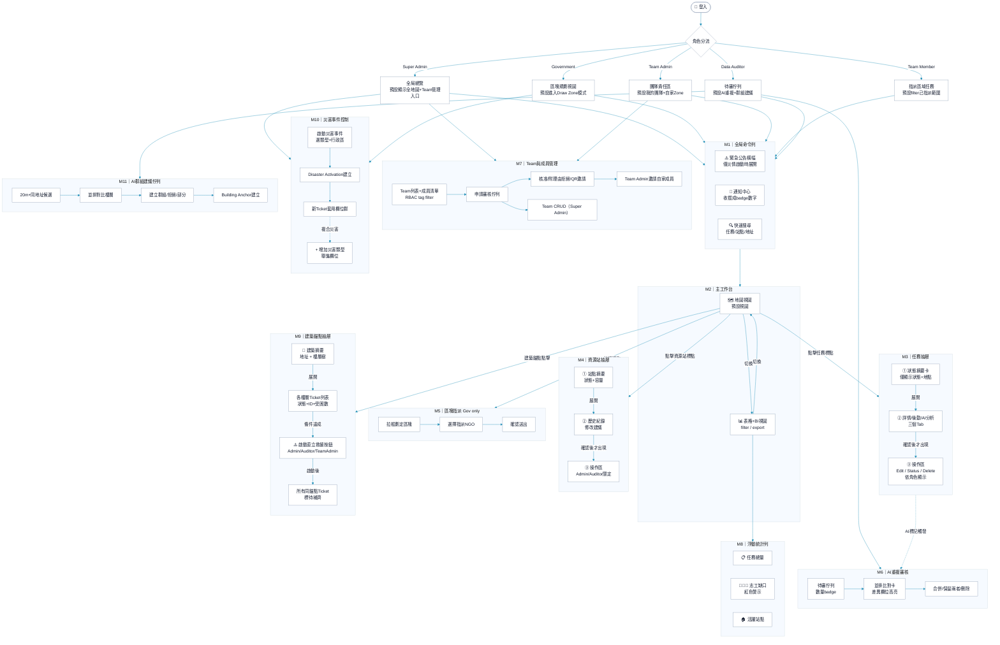
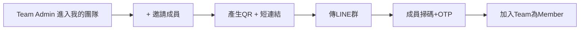
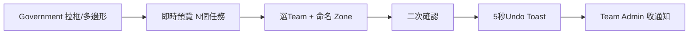
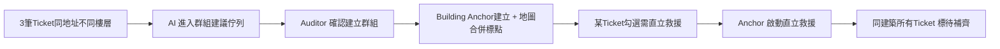

# 使用者旅程與操作流程 User Journey & Flows

本文件定義了 **島嶼守望 Wanguard** 管理後台的操作旅程與交互流程。透過角色分流，不同的權限群體將進入專屬的工作台介面。

**v2.0 更新（2026-05-28）**：加入 Team Admin / Team Member 兩個新角色路徑；加入災害類型 onboarding、地圖繪製模式、Ticket 群組化與直立救援啟動流程。

---

## 後台角色操作旅程 Mermaid 流程圖

系統支援以互動式圖表展示後台人員從登入、角色分流、全局命令、工作台切換至詳細抽屜控制的操作路徑。

---

## 互動視圖說明

1. **角色專屬初始畫面**：
   * **Super Admin**：預設進入全局地圖，含 Team 管理 / 災害事件控制 / Audit Log 跳轉面板。
   * **Government**：預設進入「劃區規劃（Draw Zone）」模式，可拉框 / 多邊形 / 圓 / 手繪 指派 Zone 給對應 Team。
   * **Team Admin**：預設進入「我的團隊」頁面（成員列表）+ 地圖只顯示自家被指派 Zone。
   * **Team Member**：地圖與表格預設只載入自家被指派的責任區任務。
   * **Data Auditor**：進入時預設開啟兩個佇列：AI 重複任務對比、AI 群組建議。
2. **工作台視圖切換 (M2)**：
   地圖模式與統計數據表格模式為一鍵無縫切換，共用篩選條件與定位參數。
3. **任務/資源站/建築錨點抽屜設計 (M3, M4, M9)**：
   點擊地圖物件由右側拉出抽屜，先精簡摘要，可展開詳細。
   * **M9 建築錨點**新增於 v2.0：點擊聚合的 🏢 圖示展開樓層樹，列出該建築所有 Ticket。
4. **災害事件控制 (M10)**：
   Super Admin / Government 可隨時啟動 / 切換災害類型，影響全平台新建 Ticket 的欄位群組。
5. **AI 群組建議 (M11)**：
   AI 偵測同建築不同樓層的 Ticket 群組，由 Auditor 確認後建立 Building Anchor。
6. **直立救援的三層觸發** （詳見 [[08-ticket-management]]）：
   * Layer 1 災害層：含直立救援的災害類型啟動時，表單顯示直立救援欄位群（預設摺疊）。
   * Layer 2 Ticket 層：填入樓層 ≠ 1F 或勾選需要直立救援時，自動轉為必填。
   * Layer 3 建築層：Building Anchor 啟動後，同建築所有 Ticket 自動必填繼承。

---

## v2.0 新增的關鍵流程

### Team Admin 邀請成員

### Government 劃區指派 + 自動連動 Team

### Ticket 群組化 + 直立救援啟動

