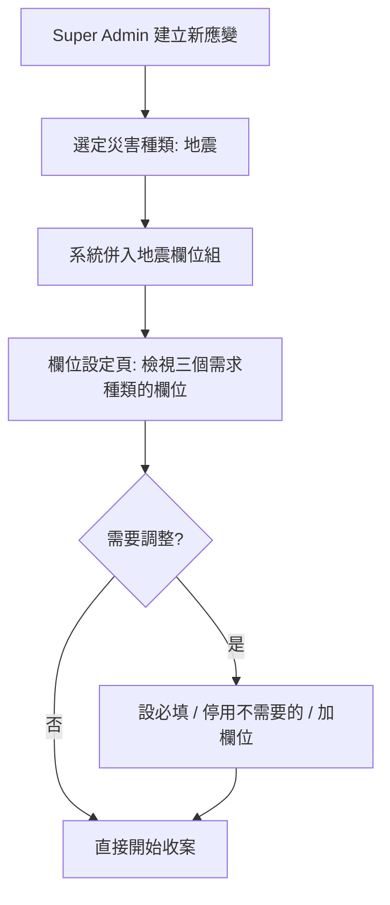

# 自訂欄位 — 使用者行為流程

涵蓋陽光、異常、邊界三類場景。**這是討論用文件**，拍板後收進 [`../prd.md`](../prd.md) 的 UX Flow 段落。

畫面見 [`custom-fields.html`](custom-fields.html)，決策依據見 [`../decisions.md`](../decisions.md) D10–D16。

標記：✅ 已拍板　🟡 待討論（見文末）　⚠️ 已知風險

---

## 涉及的人

| 角色 | 在這件事裡做什麼 |
|---|---|
| **Super Admin** | 唯一能改欄位設定的人（D14）：套用災害欄位組、加欄位、停用欄位、設必填 |
| **Team Member** | 後台代報與補件——**欄位設定的實際受害者或受益者**，表單長什麼樣他每天面對 |
| **民眾** | 前台報案。**完全不受欄位設定影響**（D4），列在這裡是為了確認這條界線不被打破 |
| **志工** | 承接 Task 時讀欄位內容判斷要不要接（例如看到「需要工具：電鋸」才知道自己能不能做） |

---

## 陽光場景

### S1 — 應變啟動，確認欄位清單

**關鍵：這一步可以被跳過。** 系統出貨的欄位組就是可用的預設，Super Admin 不做任何事也能開始收案。災難當下沒有人有空先做半小時設定。

### S2 — 應變中途加開災害（主線）

地震應變第三天，光復鄉開始淹水。

| # | 誰 | 動作 | 系統回應 |
|---|---|---|---|
| 1 | Super Admin | 欄位設定 › ＋ 加開災害 | 列出尚未開啟的災害種類 |
| 2 | | 選「水災」 | **即時預覽將加入的 4 個欄位**，標明各掛哪個需求種類 |
| 3 | | 確認加開 | 欄位併入清單、標記〔水災組〕；toast 回報新增數量 |
| 4 | Team Member | 開啟任一救援需求 | 表單多出「積水深度」「是否斷電」 |

✅ 不需要重新整理、不需要通知每個人去改設定。**欄位一出現就生效。**

⚠️ 但 Team Member 沒有被告知欄位變了——他只會發現表單「突然多了東西」。見 🟡 Q1。

### S3 — 臨時加一個欄位（未達加開災害的程度）

地震現場回報「有幾戶需要透析」，但這不值得開一個新災害。

1. Super Admin › 該需求種類 › ＋ 新增欄位
2. 搜尋「透析」→ **系統欄位庫查無**
3. 出現「自訂新欄位」區塊 → 填名稱、選型別 → 建立
4. 欄位標記〔自訂〕，在本場應變內與其他欄位完全平等（D13）

### S4 — 先手動加、後來才加開災害（整併）

這是 D12 存在的理由。

1. 水患初期，Super Admin 搜「淹水」→ 從欄位庫挑「積水深度」加入（標記〔欄位庫〕）
2. 兩天後水患擴大，決定正式加開水災
3. 加開對話框中，積水深度該列標示 **「已存在 · 自動整併」**
4. 確認後：新增 3 個、整併 1 個，**已填的 20 筆積水深度資料不需搬移**

✅ 因為手動加的欄位來自欄位庫、與災害組共用同一識別。若當初是自由輸入「淹水深度」，這裡會變成兩個並存的欄位。

### S5 — 災害退去

1. Super Admin 點災害 chip 的 ✕
2. 對話框說明：影響統計維度與地圖圖層；**勾選框「一併停用這組欄位」預設不勾**
3. 不勾 → 欄位全部留著（D10 只加不減）
4. 勾 → 該組欄位轉為停用，已填資料仍可唯讀檢視（D15）

### S6 — 代報與補件

| 階段 | 誰 | 行為 |
|---|---|---|
| 進線 | Team Member | 電話中只問得到地址、聯絡人、需求種類，先存 |
| 現勘後 | Team Member | 回頭補齊積水深度、受困人數等專業欄位 |
| 承接 | 志工 | 在承接清單看到「需要工具：電鋸」，判斷自己做得到才接 |

**必填只在儲存時檢查，不阻止先存草稿。** 🟡 Q4 要確認這一點。

---

## 異常場景

### E1 — 自訂欄位與既有欄位撞名

**觸發：** Super Admin 搜尋「積水」沒耐心看結果，直接自訂一個「積水深度」。

**目前設計的行為：** 兩個同名欄位並存，key 不同。表單上出現兩個「積水深度」。

⚠️ **這是 D12 的漏洞。** 「先搜尋」只是流程建議，沒有系統阻擋。見 🟡 Q2。

### E2 — 停用一個被設為必填的欄位

**目前設計：** 停用時同步取消必填（`enabled=false` 則 `required=false`）。

🟡 **重新啟用時要不要恢復必填？** 目前不恢復——但 Super Admin 的心智模型可能是「我只是暫時關掉」。見 🟡 Q3。

### E3 — 欄位被停用時，有人正在填那張表單

**觸發：** Team Member 打開表單、填到一半，Super Admin 停用了其中一個欄位。

**目前設計：** 未定義。可能的行為——
* (a) 已開啟的表單不受影響，儲存時照常寫入（欄位設定只影響「新開啟」的表單）
* (b) 儲存時發現欄位已停用，丟棄該值
* (c) 即時把該欄位從畫面上移除

⚠️ (c) 最糟——災難現場填到一半的東西不能消失。**建議 (a)。** 見 🟡 Q5。

### E4 — 兩個 Super Admin 同時改設定

**觸發：** 中央與地方各有一個 Super Admin，同時在欄位設定頁操作。

**目前設計：** 未定義。後端是 upsert，最後寫入者勝，且**沒有任何提示**。

⚠️ A 停用了欄位、B 同時把它設為必填 → 結果取決於誰慢一步。見 🟡 Q6。

### E5 — 型別選錯，但已經有資料

**觸發：** 自訂「積水深度」時選了「文字」，收了 50 筆「80公分」「約1米」「淹到腰」之後，發現需要數字才能排序統計。

**目前設計：** 無法變更型別。只能停用舊欄位、另建新欄位，舊資料不會轉移。

🟡 這是可接受的取捨還是要做型別轉換？見 🟡 Q7。

### E6 — 加開災害後發現選錯

**觸發：** 手滑加開了「土石流」，其實要選「水災」。

**目前設計：** 沒有復原。只能關閉土石流、再勾「一併停用該組欄位」——**兩步操作，而且會在清單裡留下一批停用欄位。**

🟡 需要一個「剛剛那步復原」嗎？見 🟡 Q8。

### E7 — 弱網或離線

**觸發：** 災區網路不穩，Super Admin 儲存欄位設定時斷線。

**目前設計：** 未定義。[[06-map-decision-support]] 已定調「離線可讀已載入資料 + 降級提示 + 連線後重試送出」。

**建議沿用同一套：** 欄位設定失敗時明確報錯並保留輸入，不要靜默失敗——**靜默失敗會讓 Super Admin 以為欄位加好了，實際上前線根本沒看到。**

---

## 邊界場景

### B1 — 欄位爆炸

長期應變開過地震、水災、火災、颱風四種災害，救援類累積 15+ 欄位。

**現況：** 表單就是一路往下長，沒有分組、沒有摺疊。Team Member 要在十幾個欄位裡找到現在要填的那三個。

⚠️ 這是**最可能實際發生**的問題，而且直接違反「報案不卡關」的精神——只是卡的是後台不是前台。見 🟡 Q9。

### B2 — 某個需求種類一個欄位都沒有

**觸發：** 物資類只有一個「品項」欄位，被停用了。

**目前設計：** 表單細節區為空。線框圖顯示「沒有啟用中的欄位，這張表單目前是空的」。

✅ 可接受——Task 本身的名稱、數量、說明不受影響，細節欄位本來就是選配。

### B3 — 重新加開曾經關閉的災害

**觸發：** 水災退了（欄位已停用），三天後又淹。

**目前設計：** 加開時偵測到欄位已存在 → **重新啟用**，不重複建立。舊資料仍在。

✅ 已在線框圖實作。

### B4 — 同一個欄位在多個需求種類都需要

**觸發：** 「需要工具」目前掛在人力類，但救援類也想記。

**目前設計：** 欄位庫的欄位帶著所屬需求種類，同一個 key 不能同時掛兩處。要在救援類也有，得自訂一個新的。

🟡 這會產生語義相同但 key 不同的兩個欄位，統計時要合併。見 🟡 Q10。

### B5 — 非 Super Admin 開啟欄位設定

**目前設計：** 未定義。

* (a) 側欄根本不顯示入口
* (b) 顯示但點進去是唯讀
* (c) 顯示但點擊報錯

**建議 (b)。** Team Member 常會想知道「為什麼多了這個欄位」，唯讀讓他自己查得到，也降低他去打擾 Super Admin 的頻率。

### B6 — 自訂欄位名稱極端輸入

空白、超長（50 字以上）、emoji、與系統欄位相同的英數 key。

**目前設計：** 只擋空白。

🟡 需要多嚴？災時打錯字重打就好，過度驗證反而卡人。傾向只做長度上限與去空白。

### B7 — 跨場次：自訂欄位升格

D13 說「用得好可升格進欄位庫」，但**誰決定、何時做、審查標準**都沒人負責（PRD 開放問題 E）。

⚠️ 不定案的話升格永遠不會發生，自訂欄位實質等同一次性——**這不算 bug，但要誠實承認。**

---

## 待討論的 UX 問題

流程走完後浮現的決策點，依重要性排序。

| # | 問題 | 為什麼重要 |
|---|---|---|
| **Q1** | 欄位變動要不要通知 Team Member？還是讓他自己發現表單變了 | S2 主線。不通知＝表單突然變樣；通知＝災時多一個干擾源 |
| **Q2** | 自訂欄位撞名要不要擋？擋的話怎麼擋（同名警告 / 強制先搜尋 / 不擋） | E1。D12 目前只是流程建議，沒有系統保障 |
| **Q3** | 欄位重新啟用時，原本的必填狀態要不要一起恢復 | E2。影響 Super Admin 對「停用」的心智模型 |
| **Q4** | 必填在什麼時機檢查——儲存時擋？還是只標示不擋 | S6。災時擋住代報是危險的，但不擋就沒有必填的意義 |
| **Q5** | 填表中途欄位被停用，那張表單怎麼辦 | E3。建議「已開啟的表單不受影響」 |
| **Q6** | 兩個 Super Admin 同時改，要不要偵測衝突 | E4。目前靜默覆蓋 |
| **Q7** | 型別選錯且已有資料，要做轉換嗎 | E5。或接受「只能新建欄位」 |
| **Q8** | 加開災害要不要能復原 | E6。目前要兩步手動收拾 |
| **Q9** | 欄位變多時表單怎麼組織——分組？摺疊？只顯示常用？ | B1。最可能實際發生的問題 |
| **Q10** | 同一欄位要掛多個需求種類嗎 | B4。允許則統計乾淨，但欄位模型要改 |
| **Q11** | 非 Super Admin 看得到欄位設定嗎 | B5。建議唯讀 |

**建議的討論順序：Q9 → Q4 → Q1 → Q5 → Q2 → 其餘。**

前四題直接影響 Team Member 每天的操作體驗，其餘多半是低頻或可事後補的。
